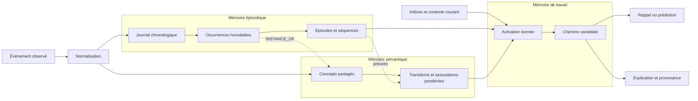
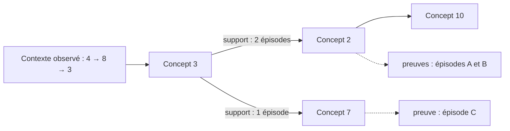
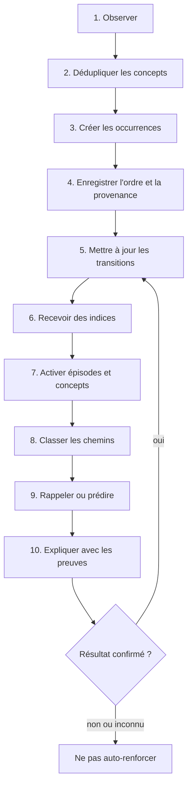

# Mémoire associative temporelle

> Un moteur expérimental de mémoire épisodique, sémantique et explicable pour agents.

**Statut :** prototype local v0.1 fonctionnel — concept expérimental, sans revendication de résultat scientifique.

Ce dépôt transforme un croquis initial en une proposition testable : conserver ce qui s'est produit dans l'ordre, consolider les motifs entre plusieurs expériences, puis retrouver ou prolonger une séquence à partir d'indices incomplets.

Le mot *neuronal* décrit l'inspiration du projet — activation, propagation, renforcement et oubli — et non un réseau de neurones entraîné par rétropropagation. Le nom technique le plus prudent est **graphe de mémoire associative temporelle**.

## Résumé en une phrase

La mémoire possède deux représentations persistantes complémentaires et une zone temporaire d'activation :

1. un journal d'**occurrences** regroupées en épisodes et ordonnées dans le temps ;
2. un graphe de **concepts** et de transitions consolidées entre plusieurs épisodes ;
3. une **mémoire de travail** qui active et classe des chemins pour le rappel ou la prédiction.

## Essayer le prototype

Le prototype fonctionne entièrement sur l'ordinateur, sans compte payant, clé API ou dépendance externe. Les souvenirs sont conservés dans une base SQLite locale.


### Sur Windows

Double-cliquer sur :

```text
lancer-agent.bat
```

Le navigateur ouvre ensuite automatiquement l'interface sur `http://127.0.0.1:8765`.

### En ligne de commande

```bash
py start_agent.py          # Windows
python start_agent.py      # macOS ou Linux
```

### Conversation d'essai

```text
Souviens-toi que mon chien s'appelle Rio.
Souviens-toi que Rio aime courir dans le parc.
De quoi te souviens-tu au sujet de Rio ?
Qu'est-ce qui vient après Rio aime ?
```

Chaque souvenir créé reçoit un identifiant. Pour le supprimer réellement :

```text
Oublie <identifiant>
```

Le moteur actuel n'est pas un modèle de langage. Il apprend des motifs de mots d'ordre 1 à 3, retrouve des épisodes et montre les preuves utilisées. Une intégration avec un LLM pourra être ajoutée après validation de cette mémoire de base.

### Exécuter les tests

```bash
py -m unittest discover -s tests -v          # Windows
python -m unittest discover -s tests -v      # macOS ou Linux
```

### Sécurité et limites

- le serveur refuse toute adresse autre que la boucle locale ;
- aucune authentification n'est fournie, car le prototype n'est pas accessible depuis le réseau ;
- les souvenirs restent dans `data/memory.sqlite3` et ne sont envoyés à aucun service externe ;
- la base n'est pas encore chiffrée : ne pas y placer de secrets ;
- le moteur est lexical et expérimental, pas un assistant général ni un système prêt pour la production.

## Le problème visé

Une base classique retrouve très bien une valeur exacte. Une recherche vectorielle retrouve des contenus semblables. Un agent a aussi besoin de répondre à des questions temporelles et associatives :

- Qu'est-ce qui s'est réellement produit ?
- Dans quel ordre ?
- Dans quel contexte cette association était-elle valable ?
- Quel événement vient probablement ensuite ?
- Quelles observations justifient ce souvenir ou cette prédiction ?
- Comment corriger ou supprimer un souvenir sans laisser d'associations orphelines ?

L'objectif n'est pas de remplacer SQL, un modèle de langage ou un système RAG. Cette mémoire devient une couche structurée que ces systèmes peuvent consulter.

## Idée fondamentale : concept ≠ occurrence

Un **concept** est une entité réutilisable : `projet Atlas`, `rapport PDF`, `envoyer`, ou simplement `3`.

Une **occurrence** est l'apparition précise d'un concept, à une position donnée d'un épisode, avec une date, une source et un contexte. Deux occurrences peuvent pointer vers le même concept sans être fusionnées.

Cette séparation préserve simultanément :

- la mémoire **épisodique** — les faits observés et leur ordre ;
- la mémoire **sémantique** — les concepts partagés et les motifs consolidés ;
- la **preuve** — les occurrences ayant contribué à chaque association.

## Architecture proposée



### 1. Journal chronologique

Le journal est la source de vérité. Il conserve les événements observés, leurs occurrences, leur ordre réel et leur provenance.

Le cercle du croquis peut être interprété de deux façons, à décider lors du prototype :

- un anneau **logique** représentant la continuité temporelle, avec archivage durable ;
- un tampon circulaire **borné**, dont les anciens épisodes sont consolidés avant remplacement.

Dans les deux cas, la dernière case ne cause pas automatiquement la première. Le graphe peut contenir des cycles, mais le temps ne « boucle » pas.

### 2. Graphe de concepts

Le graphe agrège les motifs observés entre plusieurs épisodes. Les relations restent typées afin de ne pas confondre :

- `NEXT` — succession temporelle ;
- `ASSOCIATED_WITH` — association ou cooccurrence ;
- `INSTANCE_OF` — occurrence vers concept ;
- `PART_OF` — appartenance ;
- `RESULTED_IN` — résultat observé ;
- `INFERRED` — relation proposée mais non confirmée.

Une transition agrégée conserve au minimum son nombre d'observations, sa récence, son contexte et les preuves qui l'ont créée. La corrélation, la succession et la causalité ne sont jamais considérées comme équivalentes.

Pour représenter un historique plus long que `A → B`, le moteur utilise un **motif ordonné** comme `[4, 8, 3]` et une **continuation** comme `2`. Une transition simple est seulement le cas particulier d'un motif contenant un concept. Chaque continuation reste reliée au span exact d'occurrences qui la justifie.

### 3. Mémoire de travail

Une requête active temporairement un petit ensemble de concepts et d'épisodes. L'activation se propage avec un budget strict : profondeur maximale, pénalité par saut, détection des revisites et nombre limité de candidats.

Cette zone sert à :

- faire converger plusieurs indices incomplets ;
- reconstruire un épisode ;
- classer les suites possibles ;
- produire un chemin explicatif.

## Exemple : apprendre une bifurcation

Supposons que le moteur observe les épisodes suivants :

```text
Épisode A : 4 → 8 → 3 → 2 → 10
Épisode B : 4 → 8 → 3 → 2 → 10
Épisode C : 4 → 8 → 3 → 7
```

Chaque nombre possède une occurrence distincte dans chaque épisode, mais les occurrences désignent des concepts partagés.



À partir de `4 → 8 → 3`, le moteur devrait classer `2` devant `7`, tout en montrant les deux possibilités et leurs épisodes justificatifs. Un score comme `0,78` serait un **score relatif illustratif**, pas une certitude calibrée.

## Cycle de fonctionnement



Une sortie générée par l'agent ne doit jamais devenir automatiquement une observation. Le renforcement exige une source externe, une action réellement exécutée ou un retour explicite. Cette règle évite qu'une hallucination se transforme en « souvenir » dominant.

## Opérations prévues

| Opération | Rôle | Résultat attendu |
|---|---|---|
| `observe` | Enregistrer un événement ou une séquence avec provenance | Occurrences et étendues de preuve créées de façon idempotente |
| `recall` | Retrouver des épisodes à partir d'indices incomplets | Épisodes classés, chemins et preuves |
| `predict` | Classer les prochains concepts selon l'historique et le contexte | Candidats, scores relatifs et support |
| `explain` | Composer l'explication incluse dans un rappel ou une prédiction | Facteurs de score et occurrences sources |
| `forget` | Supprimer réellement une source au MVP | Agrégats recalculés sans preuve fantôme |

## Apprentissage et classement

Le premier moteur n'a pas besoin d'un modèle neuronal entraîné. Une approche inspectable suffit pour vérifier l'hypothèse :

```text
support_décroissant(t) = support_précédent × exp(-λ × Δt) + nouvelle_observation

score(candidat) =
    force_du_suffixe_observé
  + correspondance_du_contexte
  + récence
  + convergence_des_indices
  - pénalité_de_distance
```

Pour la prédiction, une stratégie à ordre variable peut utiliser le plus long suffixe suffisamment soutenu, puis se replier progressivement :

```text
[4, 8, 3] → [8, 3] → [3]
```

Les coefficients, le lissage et la calibration seront déterminés par l'évaluation. Les valeurs retournées restent des scores de classement tant qu'elles ne sont pas calibrées comme probabilités.

## Ce qui distingue cette proposition

| Approche | Force principale | Ce qu'ajoute cette mémoire |
|---|---|---|
| Base relationnelle | exactitude, transactions, requêtes structurées | apprentissage de chemins et rappel associatif |
| Base vectorielle / RAG | similarité sémantique de contenus | ordre des événements, épisodes et transitions explicables |
| Graphe de connaissances | entités et relations sémantiques | occurrences temporelles et consolidation issue des épisodes |
| Chaîne de Markov | prédiction de transitions | contexte, historique variable, provenance et rappel épisodique |
| Réseau neuronal | représentation apprise à grande échelle | inspection et suppression ciblée des preuves |

La contribution recherchée n'est pas un composant entièrement inédit pris isolément. Elle réside dans leur combinaison : **double représentation occurrence–concept, consolidation incrémentale et explication traçable jusqu'aux observations sources**.

## Applications possibles

- mémoire persistante pour assistant ou agent IA ;
- prédiction de la prochaine action ;
- recherche associative à partir d'indices incomplets ;
- recommandation tenant compte du chemin parcouru ;
- détection de séquences inhabituelles ;
- mémoire procédurale pour robots ou automatisations ;
- parcours d'apprentissage personnalisés ;
- analyse explicable de processus et de parcours utilisateurs.

Le premier cas d'usage recommandé est la **mémoire locale d'un agent** : petite, persistante, inspectable et capable d'apprendre une bifurcation contextuelle.

## Ce que le projet ne prétend pas être

- une reproduction biologique du cerveau ;
- une conscience ou une intelligence générale ;
- un remplacement de la base transactionnelle principale ;
- une preuve que les associations découvertes sont causales ;
- une nouvelle théorie scientifique déjà validée ;
- un système prêt à recevoir des données sensibles en production.

## Documentation

- [Architecture détaillée](docs/ARCHITECTURE.md)
- [Plan de création du moteur](docs/PLAN_DE_CREATION.md)
- [Croquis à l'origine de l'idée](docs/assets/croquis-original.jpg)

## Première définition de la réussite

Le premier jalon est réussi si le moteur peut, de façon déterministe et reproductible :

1. mémoriser plusieurs épisodes partageant certains concepts ;
2. préserver chaque occurrence et sa provenance après redémarrage ;
3. retrouver un épisode à partir d'indices incomplets ;
4. prédire correctement la branche la plus fréquente ou la plus contextuelle ;
5. expliquer le résultat avec les observations exactes qui le soutiennent ;
6. supprimer une observation et recalculer ses preuves et agrégats.

## Feuille de route courte

- **v0.1 — Fondations :** modèle concept/occurrence, stockage SQLite et scénarios de référence.
- **v0.2 — Apprentissage :** transitions, contextes, idempotence et provenance.
- **v0.3 — Rappel :** recherche bornée et chemins explicatifs.
- **v0.4 — Prédiction :** historique d'ordre variable et comparaison aux baselines.
- **v0.5 — Agent :** API locale et adaptateur pour un agent.

Le plan complet, les critères d'acceptation et les tests sont décrits dans [docs/PLAN_DE_CREATION.md](docs/PLAN_DE_CREATION.md).

## Questions encore ouvertes

- Le cercle représente-t-il une chronologie illimitée ou un tampon de taille fixe ?
- Les nombres du croquis sont-ils des concepts, des positions, ou les deux selon le dessin ?
- Les liens intérieurs sont-ils observés, déclarés ou produits par une règle ?
- Une transition est-elle toujours directionnelle ?
- Comment définir le début et la fin d'un épisode ?
- Quelle place donner à la récompense, à la surprise et à l'importance ?
- Quand faut-il décroître, consolider, archiver ou supprimer un souvenir ?

Ces questions sont laissées visibles afin que le prototype teste les hypothèses au lieu de les cacher.

## Publication et licence

Ce dossier est prêt à devenir la base d'un dépôt GitHub. Avant une publication publique :

1. choisir un nom de projet définitif ;
2. choisir une licence pour la documentation et, plus tard, pour le code ;
3. retirer du croquis toute information personnelle éventuelle ;
4. ouvrir les premières issues à partir des étapes de la feuille de route ;
5. éviter toute revendication de nouveauté scientifique avant comparaison et expérimentation.

## Origine

Le projet vient d'un dessin exploratoire montrant une séquence, des nœuds réutilisés dans plusieurs chemins, une organisation circulaire et une zone interne d'associations. Ce document conserve cette intuition et la reformule en objets, règles et expériences vérifiables.

<details>
<summary>Voir le croquis original</summary>


</details>
