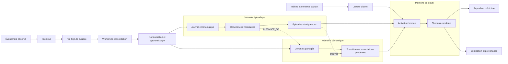
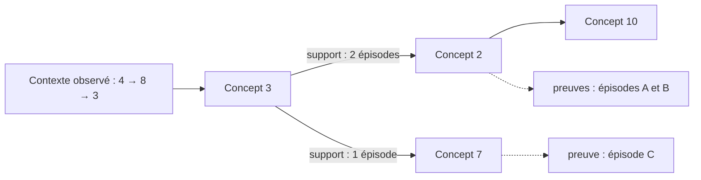
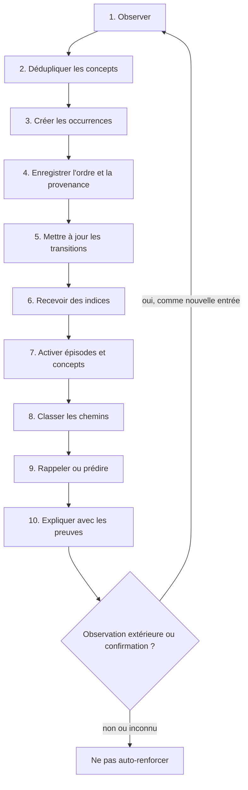
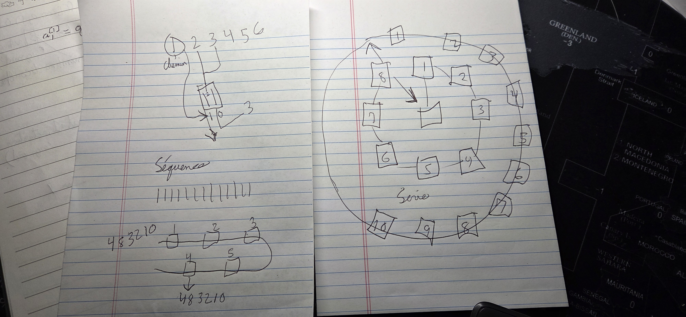

# Mémoire associative temporelle

> Un moteur expérimental de mémoire épisodique, sémantique et explicable pour agents.

**Statut :** prototype local v0.5 fonctionnel — mémoire asynchrone, calculatrice déterministe et laboratoire historique isolé expérimentaux, sans revendication de résultat scientifique.

Ce dépôt transforme un croquis initial en une proposition testable : conserver ce qui s'est produit dans l'ordre, consolider les motifs entre plusieurs expériences, puis retrouver ou prolonger une séquence à partir d'indices incomplets.

Le mot *neuronal* décrit l'inspiration du projet — activation, propagation, renforcement et oubli — et non un réseau de neurones entraîné par rétropropagation. Le nom technique le plus prudent est **graphe de mémoire associative temporelle**.

## Résumé en une phrase

La mémoire possède deux représentations persistantes complémentaires et une zone temporaire d'activation :

1. un journal d'**occurrences** regroupées en épisodes et ordonnées dans le temps ;
2. un graphe de **concepts** et de transitions consolidées entre plusieurs épisodes ;
3. une **mémoire de travail** qui active et classe des chemins pour le rappel ou la prédiction.

La v0.4 ajoute un composant séparé : une **calculatrice mathématique bornée** exécute les expressions avec un catalogue versionné. Calculer ne crée aucun souvenir; seul l'import explicite des descriptions du catalogue passe par le pipeline de mémoire.

La v0.5 ajoute un **laboratoire historique calculable**. Il génère une chronique fictive dont la vérité est connue, expose un registre fini de 11 familles de dérivations, puis teste la mémoire avec des doublons, contradictions, homonymes et événements reçus hors ordre. Ses bases SQLite sont temporaires et la mémoire principale reste intacte.

## Essayer le prototype

Le prototype fonctionne entièrement sur l'ordinateur, sans compte payant, clé API ou dépendance externe. Les souvenirs sont conservés dans une base SQLite locale.


### Sur Windows

Double-cliquer sur :

```text
lancer-agent.bat
```

Le navigateur ouvre ensuite automatiquement l'interface sur `http://127.0.0.1:8765`.

### En ligne de commande

```bash
py start_agent.py          # Windows
python start_agent.py      # macOS ou Linux
```

Pour tester la séparation v0.3 entre réception, apprentissage et lecture :

```bash
python start_agent.py --async-injection
```

Dans ce mode, une observation est d'abord inscrite dans une file SQLite durable distincte. Un worker la consolide ensuite dans la mémoire avec une connexion d'écriture, pendant que le serveur répond aux questions avec une autre connexion de lecture. L'API accepte donc rapidement l'observation, sans prétendre qu'elle est déjà interrogeable.

### Conversation d'essai

```text
Souviens-toi que mon chien s'appelle Rio.
Souviens-toi que Rio aime courir dans le parc.
De quoi te souviens-tu au sujet de Rio ?
Qu'est-ce qui vient après Rio aime ?
```

### Calculer sans mémoriser le résultat

La calculatrice peut être utilisée dans son panneau dédié ou directement dans la conversation :

```text
Calcule 2 + 3 * 4
Calcule gcd(84, 30)
Calcule frac(1, 3) + frac(1, 6)
```

Le moteur analyse une expression bornée, appelle seulement les fonctions autorisées par son catalogue, puis retourne un résultat typé, son caractère exact ou approché, la durée et la validation de la politique d'exécution. Il n'utilise pas `eval`, n'accède ni au système de fichiers ni au réseau et refuse les syntaxes ou tailles hors limites. Cette validation n'est pas un second calcul indépendant.

Trois flux restent volontairement distincts :

1. **calculer** exécute une expression et ne mémorise jamais son résultat ;
2. **décrire les règles** expose le catalogue versionné des fonctions disponibles ;
3. **apprendre ces règles** exige le bouton explicite **Importer le catalogue dans la mémoire**, qui crée des tickets idempotents dans le pipeline.

Les contrats locaux sont :

```text
GET  /api/math/catalog
POST /api/calculate
POST /api/math/catalog/import
```

Voir [Calculateur mathématique et mémoire à quatre niveaux](docs/CALCULATEUR_MATHEMATIQUE.md) pour le langage accepté, les garde-fous et le protocole expérimental.

### Mettre la mémoire à l'épreuve avec une histoire calculable

Le panneau **Laboratoire historique** construit localement une chronique fictive couvrant l'Antiquité jusqu'à 2026. Le caractère fictif est volontaire : la bonne réponse est entièrement connue et peut être vérifiée automatiquement, sans présenter une interprétation historique contestée comme une vérité unique.

Le scénario fournit des dates civiles sans année zéro, des entités homonymes dans plusieurs contextes, des mesures, des coordonnées et des changements d'état. Il introduit ensuite des doublons idempotents, des contradictions conservées et un ordre de réception différent de l'ordre historique.

Toutes les valeurs dont les entrées existent sont calculées par un registre fini de **11 familles** : durées civiles en années, mois et jours, milieux temporels, âges, intervalles, conversions d'unités, variations absolues et relatives, taux annuels et distances géographiques. Chaque dérivation conserve sa formule, ses entrées, son unité, sa version et les identifiants de ses faits sources. Elle est injectée comme `inferred` dans la base de test et ne devient jamais une preuve indépendante.

Deux routes locales alimentent cette interface :

```text
GET  /api/stress/history/catalog
POST /api/stress/history/run
```

Un seul test peut fonctionner à la fois. L'interface accepte de 5 à 100 faits sources; le script local permet des expériences plus grandes :

```bash
python scripts/benchmark_history.py --count 25 --seed 20260721
```

Chaque exécution crée une mémoire et une file SQLite dans un répertoire temporaire, mesure rappel, déduplication, provenance, débit, latence et stockage, ferme les bases puis supprime le répertoire. Elle n'ouvre et ne modifie jamais `data/memory.sqlite3` ou `data/injection.sqlite3`.

Le score publié porte uniquement sur des questions sémantiques contrôlées : date, état le plus récent, contexte et contradiction. Les recherches par marqueur exact de fait ou de dérivation sont publiées séparément comme **diagnostic de plomberie** et ne gonflent pas ce score. Si la file ne se vide pas, si un ticket échoue ou si le nombre de travaux terminés diffère de l'attendu, le run est déclaré incomplet et aucune question n'est scorée.

Le moteur principal ne possède pas encore un classement bitemporel natif : `valid_from` est conservé comme preuve, mais son ordre interne reste l'ordre d'ingestion. Cette limite est publiée dans chaque rapport. Voir [Mémoire historique calculable](docs/MEMOIRE_HISTORIQUE_CALCULABLE.md) et le [benchmark local v0.5](docs/BENCHMARK_HISTORY_V05.md).

### Importer des souvenirs JSON

Le bouton **Importer JSON** de l'interface accepte un fichier `.json` UTF-8 contenant un objet ou une liste, jusqu'à 1 Mio et 200 souvenirs utiles. On peut le choisir ou le glisser dans la fenêtre guidée. L'import reste local et suit deux étapes :

1. **Aperçu** — le fichier est validé et décodé, ses valeurs utiles sont transformées en souvenirs proposés et rangées dans des catégories informatives ; rien n'est encore écrit dans la mémoire.
2. **Confirmation** — le bouton **Importer … souvenirs** enregistre les éléments valides, puis l'interface actualise les statistiques et les souvenirs. Chaque élément garde son nom de fichier, son chemin JSON et un identifiant d'import. En mode `--async-injection`, la confirmation retourne `HTTP 202 Accepted` avec un ticket par souvenir : le fichier est accepté dans la file, puis devient visible après consolidation.

Un fichier d'essai est fourni dans [`examples/souvenirs-exemple.json`](examples/souvenirs-exemple.json). Il contient un profil, des préférences, des projets et un événement. Les objets imbriqués et les tableaux sont parcourus sans exécuter leur contenu ; par exemple, la valeur `Atlas` garde le chemin `$.projets[0].nom` comme élément de provenance.

Un second jeu prêt à interroger, [`examples/planetes-nasa.json`](examples/planetes-nasa.json), contient une fiche compacte pour chacune des huit planètes. Sa [fiche d'accompagnement](examples/PLANETES-NASA.md) indique les sources NASA et propose des questions de démonstration.

Après l'import, on peut interroger naturellement la mémoire :

```text
Que sais-tu de Atlas ?
De quoi te souviens-tu au sujet de Montréal ?
Rappelle-moi espresso.
Explique pourquoi tu te souviens de préparer le prototype.
```

Le classement automatique est une aide d'organisation fondée sur les noms de clés, les chemins et les types JSON. Une grande section racine, comme `projets`, devient sa propre catégorie ; les enveloppes génériques comme `data` ou `items` sont ignorées au profit des clés utiles. Les valeurs isolées utilisent les familles `identite`, `temps`, `localisation`, `preference`, `relation`, `finance`, `activite`, `mesure` ou `general`. Les catégories de l'aperçu ne sont pas encore modifiables. Ce n'est pas une compréhension sémantique garantie.

Limites du prototype : fichier et données JSON canoniques de 1 Mio au maximum, enveloppe HTTP interne de 3 Mio, profondeur de 32 niveaux, 10 000 nœuds JSON, 200 souvenirs proposés, 10 000 concepts textuels au total et 4 000 caractères par texte. Une valeur dépassant la borne est refusée plutôt que tronquée. Le texte original sert seulement au décodage et n'est pas conservé comme fichier. Les très grands entiers sont transmis sans l'arrondi de JavaScript et les clés dupliquées sont refusées. Réimporter exactement le même contenu ne duplique pas les mêmes chemins ; un contenu modifié constitue une nouvelle version logique.

Chaque souvenir créé reçoit un identifiant. Pour le supprimer réellement :

```text
Oublie <identifiant>
```

Le moteur actuel n'est pas un modèle de langage. Il apprend des motifs de mots d'ordre 1 à 3, retrouve des épisodes et montre les preuves utilisées. Une intégration avec un LLM pourra être ajoutée après validation de cette mémoire de base.

### Observer le pipeline v0.3

Une écriture asynchrone retourne un `job_id`. Son état passe normalement de `pending` à `processing`, puis à `completed`; après un nombre borné d'échecs, il passe à `failed`. Les routes locales suivantes permettent de suivre le traitement sans exposer le texte du souvenir :

```text
GET /api/pipeline
GET /api/pipeline/jobs/<job_id>
```

`GET /api/pipeline` publie notamment la profondeur de file, son retard, l'état du worker, le nombre de soumissions reçues et dédoublonnées, ainsi que les tailles de la mémoire et de la file en incluant leurs journaux WAL/SHM. Une même clé d'idempotence avec le même contenu retrouve le ticket original; la réutiliser avec un autre fait est refusé.

Le pipeline applique une livraison **au moins une fois** entre la file et le moteur. L'idempotence du moteur empêche un crash situé après l'apprentissage mais avant l'acquittement de renforcer deux fois le même souvenir.

La file et la connexion écrivain de la mémoire valident leurs mutations SQLite avec `synchronous=FULL`. Les observations, oublis et nettoyages passent par cet écrivain durable; la connexion de lecture reste séparée et n'est jamais utilisée pour modifier la mémoire.

### Mesurer le pipeline sans toucher à la mémoire principale

```bash
python scripts/benchmark_pipeline.py --count 100
```

Le benchmark crée ses propres bases temporaires, injecte un jeu déterministe comprenant des doublons, interroge la mémoire pendant les écritures, imprime un rapport JSON, puis supprime ces bases. Il mesure le nombre de soumissions uniques, complétées, échouées et dédoublonnées, le pourcentage de dédoublonnage, les latences d'injection moyenne/p50/p95, le débit de consolidation, les latences de rappel p50/p95/p99 pendant les écritures, les erreurs de lecture, la taille de la file, la taille de la mémoire et la séparation effective du lecteur et de l'écrivain.

Le bouton **Tester avec 25 souvenirs** exerce le pipeline réel sans contaminer durablement la mémoire principale. Le serveur crée le run persistant et ses 25 tickets dans une seule transaction : ils existent tous, ou aucun n'existe. Dès que tous les tickets sont terminaux, le serveur retire automatiquement les événements synthétiques et les tickets, y compris si l'onglet a été fermé. Après un redémarrage, il reprend un nettoyage interrompu. Un bilan persistant conserve seulement l'état du run, ses compteurs, ses dates et une éventuelle erreur; les textes synthétiques ne deviennent jamais des preuves fiables.

Important : la v0.3 réduit le temps d'attente de l'injecteur et maintient le lecteur disponible; elle ne rend pas encore la consolidation rapide à l'échelle du milliard. `MemoryEngine.observe` reconstruit encore les preuves de l'épisode et rafraîchit des agrégats globaux. Le coût augmente donc fortement avec la taille. La prochaine étape est une consolidation réellement incrémentale, des épisodes bornés et des compteurs de file sans scans globaux. Voir [`docs/BENCHMARK_V03.md`](docs/BENCHMARK_V03.md) pour les mesures et leur interprétation.

### Mesurer la calculatrice

```bash
python scripts/benchmark_math.py --count 100000
python scripts/benchmark_math.py --count 1000000 --warmup 5000
```

Ce benchmark génère des familles d'expressions reproductibles, compare leurs résultats à un chemin de calcul indépendant et rapporte exactitude, erreurs, débit et latences p50/p95/p99. Il vérifie également des expressions interdites et rapporte le nombre d'écritures mémoire, qui doit rester nul. Les résultats dépendent de la machine et doivent être publiés avec les conditions d'exécution; ce README n'en extrapole aucun chiffre.

Le rapport local reproductible de la v0.4 est publié dans [`docs/BENCHMARK_MATH_V04.md`](docs/BENCHMARK_MATH_V04.md) : 1 000 000/1 000 000 résultats corrects dans le jeu généré, aucune erreur et aucune écriture mémoire.

### Exécuter les tests

```bash
py -m unittest discover -s tests -v          # Windows
python -m unittest discover -s tests -v      # macOS ou Linux
```

### Sécurité et limites

- le serveur refuse toute adresse autre que la boucle locale ;
- aucune authentification n'est fournie, car le prototype n'est pas accessible depuis le réseau ;
- les souvenirs restent dans `data/memory.sqlite3` et ne sont envoyés à aucun service externe ;
- en mode asynchrone, les observations en attente sont aussi conservées localement dans `data/injection.sqlite3` ;
- l'aperçu JSON doit être vérifié avant l'import, surtout lorsqu'un fichier contient des données personnelles ;
- le contenu JSON est traité comme une donnée, jamais comme du code, et le fichier source complet n'est pas archivé ;
- la base n'est pas encore chiffrée : ne pas y placer de secrets ;
- le moteur est lexical et expérimental, pas un assistant général ni un système prêt pour la production ;
- une réponse produite par l'agent n'est jamais replacée automatiquement dans la file d'apprentissage ; seules une observation extérieure, une action exécutée ou une confirmation explicite peuvent créer un souvenir fiable.
- un résultat de calcul n'est jamais une preuve d'apprentissage automatique ; seules les règles du catalogue importées volontairement peuvent rejoindre la mémoire.
- les faits et calculs du laboratoire historique restent dans des bases temporaires isolées ; les dérivations portent la source `inferred` et ne renforcent pas les faits observés.
- une mesure à unité inconnue est conservée comme donnée opaque avec `calculable: false`; elle n'est ni devinée ni rejetée, mais sa dérivation est ignorée. Une monnaie sans taux daté ou une entrée manquante produit elle aussi un calcul sauté.

## Le problème visé

Une base classique retrouve très bien une valeur exacte. Une recherche vectorielle retrouve des contenus semblables. Un agent a aussi besoin de répondre à des questions temporelles et associatives :

- Qu'est-ce qui s'est réellement produit ?
- Dans quel ordre ?
- Dans quel contexte cette association était-elle valable ?
- Quel événement vient probablement ensuite ?
- Quelles observations justifient ce souvenir ou cette prédiction ?
- Comment corriger ou supprimer un souvenir sans laisser d'associations orphelines ?

L'objectif n'est pas de remplacer SQL, un modèle de langage ou un système RAG. Cette mémoire devient une couche structurée que ces systèmes peuvent consulter.

## Idée fondamentale : concept ≠ occurrence

Un **concept** est une entité réutilisable : `projet Atlas`, `rapport PDF`, `envoyer`, ou simplement `3`.

Une **occurrence** est l'apparition précise d'un concept, à une position donnée d'un épisode, avec une date, une source et un contexte. Deux occurrences peuvent pointer vers le même concept sans être fusionnées.

Cette séparation préserve simultanément :

- la mémoire **épisodique** — les faits observés et leur ordre ;
- la mémoire **sémantique** — les concepts partagés et les motifs consolidés ;
- la **preuve** — les occurrences ayant contribué à chaque association.

## Architecture proposée



La file d'injection et la mémoire utilisent deux fichiers SQLite distincts. Le worker possède sa connexion d'écriture au moteur; le lecteur en possède une autre. Le mode WAL permet au lecteur de rester disponible pendant l'écriture, tout en conservant la règle SQLite d'un seul écrivain à la fois dans la base mémoire. La file et l'écrivain utilisent `synchronous=FULL` pour leurs mutations durables.

### 1. Journal chronologique

Le journal est la source de vérité. Il conserve les événements observés, leurs occurrences, leur ordre réel et leur provenance.

Le cercle du croquis peut être interprété de deux façons, à décider lors du prototype :

- un anneau **logique** représentant la continuité temporelle, avec archivage durable ;
- un tampon circulaire **borné**, dont les anciens épisodes sont consolidés avant remplacement.

Dans les deux cas, la dernière case ne cause pas automatiquement la première. Le graphe peut contenir des cycles, mais le temps ne « boucle » pas.

### 2. Graphe de concepts

Le graphe agrège les motifs observés entre plusieurs épisodes. Les relations restent typées afin de ne pas confondre :

- `NEXT` — succession temporelle ;
- `ASSOCIATED_WITH` — association ou cooccurrence ;
- `INSTANCE_OF` — occurrence vers concept ;
- `PART_OF` — appartenance ;
- `RESULTED_IN` — résultat observé ;
- `INFERRED` — relation proposée mais non confirmée.

Une transition agrégée conserve au minimum son nombre d'observations, sa récence, son contexte et les preuves qui l'ont créée. La corrélation, la succession et la causalité ne sont jamais considérées comme équivalentes.

Pour représenter un historique plus long que `A → B`, le moteur utilise un **motif ordonné** comme `[4, 8, 3]` et une **continuation** comme `2`. Une transition simple est seulement le cas particulier d'un motif contenant un concept. Chaque continuation reste reliée au span exact d'occurrences qui la justifie.

### 3. Mémoire de travail

Une requête active temporairement un petit ensemble de concepts et d'épisodes. L'activation se propage avec un budget strict : profondeur maximale, pénalité par saut, détection des revisites et nombre limité de candidats.

Cette zone sert à :

- faire converger plusieurs indices incomplets ;
- reconstruire un épisode ;
- classer les suites possibles ;
- produire un chemin explicatif.

## Exemple : apprendre une bifurcation

Supposons que le moteur observe les épisodes suivants :

```text
Épisode A : 4 → 8 → 3 → 2 → 10
Épisode B : 4 → 8 → 3 → 2 → 10
Épisode C : 4 → 8 → 3 → 7
```

Chaque nombre possède une occurrence distincte dans chaque épisode, mais les occurrences désignent des concepts partagés.



À partir de `4 → 8 → 3`, le moteur devrait classer `2` devant `7`, tout en montrant les deux possibilités et leurs épisodes justificatifs. Un score comme `0,78` serait un **score relatif illustratif**, pas une certitude calibrée.

## Cycle de fonctionnement



Une sortie générée par l'agent ne doit jamais devenir automatiquement une observation. Le renforcement exige une source externe, une action réellement exécutée ou un retour explicite. Cette règle évite qu'une hallucination se transforme en « souvenir » dominant.

## Quatre niveaux d'apprentissage

La v0.4 distingue la réception d'une information de son droit à guider l'agent :

| Niveau | Signification | Exemple |
|---|---|---|
| **Reçu** | contenu accepté ou répertorié, pas encore utilisable comme preuve | proposition placée dans une file |
| **Observé** | fait provenant d'une source extérieure ou d'une action réellement exécutée | résultat confirmé par un outil indépendant |
| **Consolidé** | motif soutenu par plusieurs observations traçables | transition renforcée avec ses épisodes justificatifs |
| **Opérationnel** | règle testée, bornée et autorisée à être exécutée par un moteur déterministe | fonction du catalogue mathématique versionné |

Une fonction opérationnelle n'autorise pas l'auto-apprentissage de toutes ses sorties. Le calculateur peut produire un grand nombre de résultats sans agrandir la mémoire; seules une règle importée explicitement ou une nouvelle observation extérieure suit le cycle d'apprentissage.

## Opérations prévues

| Opération | Rôle | Résultat attendu |
|---|---|---|
| `observe` | Enregistrer un événement ou une séquence avec provenance | En mode asynchrone, ticket durable `HTTP 202`, puis occurrences et preuves créées de façon idempotente |
| `recall` | Retrouver des épisodes à partir d'indices incomplets | Épisodes classés, chemins et preuves |
| `predict` | Classer les prochains concepts selon l'historique et le contexte | Candidats, scores relatifs et support |
| `explain` | Composer l'explication incluse dans un rappel ou une prédiction | Facteurs de score et occurrences sources |
| `forget` | Supprimer réellement une source au MVP | Agrégats recalculés sans preuve fantôme |
| `calculate` | Exécuter une expression dans le registre mathématique borné | Résultat exact ou approché, durée et validation de politique, sans écriture mémoire |
| `catalog` | Décrire les fonctions mathématiques opérationnelles | Catalogue versionné inspectable et import facultatif |

## Apprentissage et classement

Le premier moteur n'a pas besoin d'un modèle neuronal entraîné. Une approche inspectable suffit pour vérifier l'hypothèse :

```text
support_décroissant(t) = support_précédent × exp(-λ × Δt) + nouvelle_observation

score(candidat) =
    force_du_suffixe_observé
  + correspondance_du_contexte
  + récence
  + convergence_des_indices
  - pénalité_de_distance
```

Pour la prédiction, une stratégie à ordre variable peut utiliser le plus long suffixe suffisamment soutenu, puis se replier progressivement :

```text
[4, 8, 3] → [8, 3] → [3]
```

Les coefficients, le lissage et la calibration seront déterminés par l'évaluation. Les valeurs retournées restent des scores de classement tant qu'elles ne sont pas calibrées comme probabilités.

## Ce qui distingue cette proposition

| Approche | Force principale | Ce qu'ajoute cette mémoire |
|---|---|---|
| Base relationnelle | exactitude, transactions, requêtes structurées | apprentissage de chemins et rappel associatif |
| Base vectorielle / RAG | similarité sémantique de contenus | ordre des événements, épisodes et transitions explicables |
| Graphe de connaissances | entités et relations sémantiques | occurrences temporelles et consolidation issue des épisodes |
| Chaîne de Markov | prédiction de transitions | contexte, historique variable, provenance et rappel épisodique |
| Réseau neuronal | représentation apprise à grande échelle | inspection et suppression ciblée des preuves |

La contribution recherchée n'est pas un composant entièrement inédit pris isolément. Elle réside dans leur combinaison : **double représentation occurrence–concept, consolidation incrémentale et explication traçable jusqu'aux observations sources**.

## Hypothèse de recherche : petit modèle et mémoire externe

L'hypothèse à tester est qu'un **petit modèle couplé à une mémoire externe** peut laisser dans la mémoire une partie des faits précis, changeants ou personnels qui seraient autrement difficiles à graver dans l'entraînement. Si cette séparation fonctionne, elle pourrait réduire la quantité de données factuelles à répéter pendant l'entraînement et, pour une couverture factuelle donnée, permettre d'utiliser moins de paramètres.

La calculatrice ajoute une deuxième externalisation possible : un petit modèle pourrait sélectionner une fonction et formuler une expression au lieu d'encoder approximativement chaque procédure et chaque résultat dans ses poids. Cette idée est plausible mais **non démontrée** par le prototype; elle devra être comparée au même modèle sans outil, avec les mêmes tâches, prompts et budgets.

Ce n'est pas l'hypothèse qu'une base de souvenirs remplace un modèle. Les paramètres nécessaires à la langue, au raisonnement, à la représentation des concepts, à la planification et à l'usage correct des souvenirs restent dans le modèle. La mémoire ajoute aussi ses propres coûts : stockage, indexation, sélection du bon contexte, latence et risque de rappeler une mauvaise preuve.

La comparaison minimale doit utiliser les mêmes questions, budgets et corpus de test pour :

1. un grand modèle sans mémoire externe ;
2. un petit modèle sans mémoire ;
3. le même petit modèle avec recherche vectorielle comme baseline ;
4. le même petit modèle avec cette mémoire associative temporelle.

Les tests sépareront faits mémorisables, mises à jour après entraînement, ordre temporel, raisonnement sur plusieurs indices et qualité de langue. Ils mesureront exactitude, hallucinations, données d'entraînement, nombre de paramètres, tokens injectés, latence, mémoire vive et taille disque. Le projet ne conclura à une réduction utile que si le petit modèle avec mémoire rejoint ou dépasse une baseline plus grande sur les tâches factuelles ciblées sans masquer une baisse de raisonnement ou de langage.

## Applications possibles

- mémoire persistante pour assistant ou agent IA ;
- prédiction de la prochaine action ;
- recherche associative à partir d'indices incomplets ;
- recommandation tenant compte du chemin parcouru ;
- détection de séquences inhabituelles ;
- mémoire procédurale pour robots ou automatisations ;
- parcours d'apprentissage personnalisés ;
- analyse explicable de processus et de parcours utilisateurs.

Le premier cas d'usage recommandé est la **mémoire locale d'un agent** : petite, persistante, inspectable et capable d'apprendre une bifurcation contextuelle.

## Ce que le projet ne prétend pas être

- une reproduction biologique du cerveau ;
- une conscience ou une intelligence générale ;
- un remplacement de la base transactionnelle principale ;
- une preuve que les associations découvertes sont causales ;
- une nouvelle théorie scientifique déjà validée ;
- un système prêt à recevoir des données sensibles en production.

## Documentation

- [Architecture détaillée](docs/ARCHITECTURE.md)
- [Plan de création du moteur](docs/PLAN_DE_CREATION.md)
- [Calculateur mathématique et mémoire à quatre niveaux](docs/CALCULATEUR_MATHEMATIQUE.md)
- [Benchmark du calculateur v0.4](docs/BENCHMARK_MATH_V04.md)
- [Mesures du pipeline v0.3](docs/BENCHMARK_V03.md)
- [Mémoire historique calculable](docs/MEMOIRE_HISTORIQUE_CALCULABLE.md)
- [Benchmark du laboratoire historique v0.5](docs/BENCHMARK_HISTORY_V05.md)
- [Croquis à l'origine de l'idée](docs/assets/croquis-original.jpg)

## Première définition de la réussite

Le premier jalon est réussi si le moteur peut, de façon déterministe et reproductible :

1. mémoriser plusieurs épisodes partageant certains concepts ;
2. préserver chaque occurrence et sa provenance après redémarrage ;
3. retrouver un épisode à partir d'indices incomplets ;
4. prédire correctement la branche la plus fréquente ou la plus contextuelle ;
5. expliquer le résultat avec les observations exactes qui le soutiennent ;
6. supprimer une observation et recalculer ses preuves et agrégats ;
7. accepter rapidement une observation dans une file durable et la retrouver après consolidation ;
8. conserver la lecture disponible pendant que le worker écrit ;
9. reprendre un travail interrompu sans doubler l'apprentissage.
10. calculer une expression autorisée avec un résultat typé et validé par la politique du moteur sans écrire dans la mémoire ;
11. importer explicitement et idempotemment le catalogue des règles, sans importer les résultats produits.
12. calculer les 11 familles historiques annoncées uniquement lorsque leurs entrées sont disponibles et compatibles ;
13. séparer le score sémantique du diagnostic de plomberie et ne rien scorer tant que le pipeline est incomplet.

## Feuille de route courte

- **v0.1 — Fondations :** modèle concept/occurrence, stockage SQLite, rappel et prédiction explicables.
- **v0.2 — Données :** import JSON en deux temps, idempotence, provenance et exemples interrogeables.
- **v0.3 — Pipeline séparé :** file durable, tickets `HTTP 202`, worker de consolidation, lecteur distinct et métriques de retard/dédoublonnage/taille.
- **v0.4 — Calcul déterministe :** catalogue versionné, expressions bornées, résultats traçables, benchmark avec oracle indépendant sans écriture mémoire et import explicite des règles.
- **v0.5 — Histoire calculable :** oracle indépendant, 11 familles de dérivations, corpus fictif isolé et benchmark séparant score sémantique et plomberie.
- **v0.6 — Modèle :** adaptateur pour petit modèle et expériences comparatives avec les baselines sans mémoire, calculatrice et RAG.

Le plan complet, les critères d'acceptation et les tests sont décrits dans [docs/PLAN_DE_CREATION.md](docs/PLAN_DE_CREATION.md).

## Questions encore ouvertes

- Le cercle représente-t-il une chronologie illimitée ou un tampon de taille fixe ?
- Les nombres du croquis sont-ils des concepts, des positions, ou les deux selon le dessin ?
- Les liens intérieurs sont-ils observés, déclarés ou produits par une règle ?
- Une transition est-elle toujours directionnelle ?
- Comment définir le début et la fin d'un épisode ?
- Quelle place donner à la récompense, à la surprise et à l'importance ?
- Quand faut-il décroître, consolider, archiver ou supprimer un souvenir ?

Ces questions sont laissées visibles afin que le prototype teste les hypothèses au lieu de les cacher.

## Publication et licence

Le projet est publié dans le dépôt GitHub [sxc3030-eng/memoire-associative-temporelle](https://github.com/sxc3030-eng/memoire-associative-temporelle). Pour les prochaines versions publiques :

1. choisir une licence explicite pour le code et la documentation ;
2. vérifier que les exemples et le croquis ne contiennent aucune information personnelle ;
3. ouvrir ou actualiser les issues à partir de la feuille de route ;
4. publier les conditions exactes des benchmarks avec leurs résultats ;
5. éviter toute revendication de nouveauté scientifique ou d'échelle massive avant comparaison et expérimentation.

## Origine

Le projet vient d'un dessin exploratoire montrant une séquence, des nœuds réutilisés dans plusieurs chemins, une organisation circulaire et une zone interne d'associations. Ce document conserve cette intuition et la reformule en objets, règles et expériences vérifiables.

<details>
<summary>Voir le croquis original</summary>



</details>
