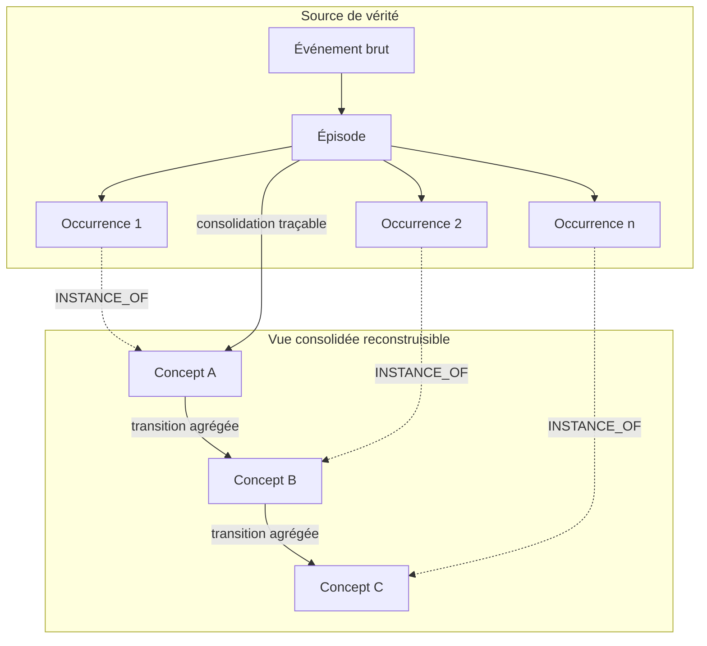
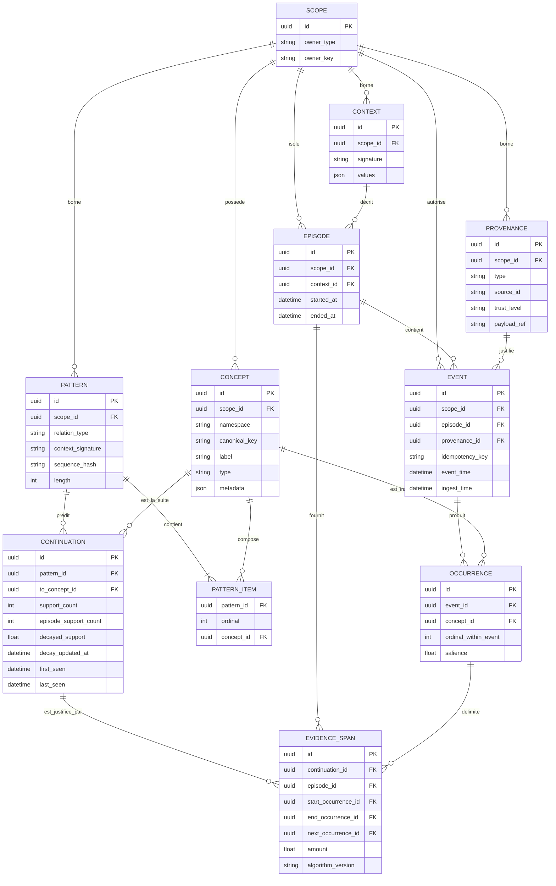
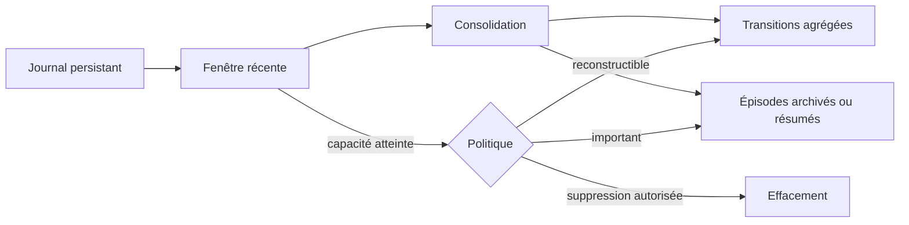

# Architecture du moteur de mémoire

Ce document formalise la première version de l'idée. Il décrit les responsabilités, le modèle de données, les règles d'apprentissage et les garde-fous. Les choix marqués **à valider** devront être testés pendant le prototype.

## 1. Objectifs d'architecture

Le moteur doit :

- enregistrer les faits observés dans leur ordre réel ;
- distinguer une idée stable de chacune de ses apparitions ;
- consolider progressivement des transitions entre concepts ;
- retrouver un épisode à partir de plusieurs indices partiels ;
- classer les suites possibles selon l'historique et le contexte ;
- expliquer chaque résultat par des preuves enregistrées ;
- oublier ou supprimer sans laisser de preuves fantômes ;
- borner les parcours afin qu'un cycle ne provoque jamais une activation infinie.

## 2. Non-objectifs de la première version

- comprendre librement du texte sans extracteur externe ;
- entraîner un réseau neuronal différentiable ;
- gérer plusieurs machines ou plusieurs régions ;
- remplacer la base métier de l'application ;
- décider seul qu'une corrélation est causale ;
- fournir une autonomie générale à un agent.

## 3. Modèle mental



Le journal épisodique est la source de vérité. Les transitions du graphe sont des agrégats reconstruisibles. Cela permet de corriger ou de supprimer un événement, puis de recalculer exactement son influence.

## 4. Glossaire

| Terme | Définition |
|---|---|
| Événement | Entrée observée provenant d'une conversation, d'un outil, d'une action ou d'une source externe. |
| Épisode | Groupe ordonné d'événements partageant une session, une tâche ou un objectif. |
| Concept | Entité canonique réutilisable, par exemple une personne, une action, un projet ou un symbole. |
| Occurrence | Apparition d'un concept dans un épisode, à une position et un instant précis. |
| Motif | Suite ordonnée de concepts utilisée comme historique, par exemple `[4, 8, 3]`. |
| Continuation | Concept observé immédiatement après un motif ; un motif de longueur 1 représente une transition simple. |
| Étendue de preuve | Ensemble ordonné d'occurrences reliant un motif à sa continuation. |
| Contexte | Clés typées qui modifient la pertinence : utilisateur, projet, session, lieu ou mode. |
| Provenance | Type et identité de la source ayant produit un événement, avec son niveau de confiance. |
| Activation | Valeur temporaire utilisée pour explorer et classer le voisinage d'un indice. |
| Consolidation | Transformation d'expériences détaillées en motifs agrégés sans perdre la provenance. |
| Oubli doux | Réduction de pertinence sans suppression de la source. |
| Suppression forte | Effacement d'une source et recalcul de toutes les preuves et agrégats concernés. |

## 5. Entités persistantes



### Invariants essentiels

1. Une occurrence appartient à exactement un événement et un concept ; son épisode est dérivé de l'événement.
2. La portée de l'épisode, de l'événement, du concept et du motif doit être identique. Le contexte n'est jamais une barrière d'autorisation.
3. L'unicité d'ingestion porte sur `(scope_id, idempotency_key)`.
4. L'unicité d'un concept porte sur `(scope_id, namespace, canonical_key)`.
5. L'unicité d'un contexte porte sur `(scope_id, signature)`.
6. L'unicité d'un motif porte sur `(scope_id, relation_type, context_signature, sequence_hash)` ; ses éléments sont uniques par `(pattern_id, ordinal)` ; une continuation est unique par `(pattern_id, to_concept_id)`.
7. Une continuation possède au moins une étendue de preuve vérifiable et chaque étendue est unique pour son span d'occurrences.
8. Une preuve désigne uniquement une observation, jamais une simple sortie générée par l'agent.
9. `event_time` représente le moment observé ; `ingest_time` représente le moment d'arrivée.
10. L'ordre d'un épisode reste déterministe même en présence d'événements en retard.
11. Plusieurs concepts non ordonnés dans un même événement créent une cooccurrence, pas une transition `NEXT`.
12. Une suppression forte retire les preuves avant de recalculer les continuations agrégées.
13. Les relations `NEXT`, `ASSOCIATED_WITH`, `RESULTED_IN` et `INFERRED` ne partagent pas la même sémantique.
14. Un score de classement n'est pas appelé « probabilité » sans calibration mesurée.
15. Toutes les lectures traversant le graphe ont une profondeur, un budget et une limite de résultats.

Pour le MVP, les concepts sont privés à une portée. Des concepts système globaux pourront être ajoutés plus tard comme référentiel en lecture seule, sans rendre les souvenirs privés globaux.

## 6. Journal, anneau et consolidation

Le dessin circulaire est conservé comme métaphore d'une fenêtre active. L'implémentation recommandée sépare :

- un journal persistant orienté ajout pour l'audit et la reconstruction, avec une voie explicite de correction et d'effacement ;
- une fenêtre récente, éventuellement implémentée comme tampon circulaire ;
- des résumés ou épisodes consolidés destinés aux recherches rapides.



**Décision à valider :** au MVP, ne supprimer automatiquement aucune observation. Simuler la décroissance dans le score, puis mesurer avant d'introduire un tampon destructif.

## 7. Écriture d'un souvenir

### Entrée minimale

```json
{
  "scope_id": "scope-user-1",
  "episode_id": "episode-a",
  "idempotency_key": "source-42:event-007",
  "event_time": "2026-07-20T16:38:28-04:00",
  "provenance": {
    "type": "user_confirmed",
    "source_id": "conversation:42",
    "trust_level": "confirmed",
    "payload_ref": "content:007"
  },
  "context": {
    "project": "atlas"
  },
  "sequence_items": [
    {"ordinal": 0, "concept_key": "action:ouvrir"},
    {"ordinal": 1, "concept_key": "object:projet-atlas"}
  ]
}
```

`sequence_items` est explicitement ordonné. Un champ séparé `concepts` peut contenir un ensemble non ordonné ; ses membres ne produisent alors aucune relation `NEXT` entre eux.

### Pipeline

1. Valider la portée, la provenance et la clé d'idempotence.
2. Canoniser le contexte et calculer sa signature indépendamment de la portée d'accès.
3. Normaliser les clés de concepts dans un espace de noms privé à la portée.
4. Créer l'événement, puis une occurrence par concept reconnu.
5. Ordonner les événements par temps et les éléments explicitement séquencés par `ordinal_within_event`.
6. Extraire les motifs de longueur `1..k_max` et leurs continuations uniquement depuis les éléments ordonnés.
7. Créer une étendue de preuve contenant le début, la fin et la continuation observée.
8. Mettre à jour les agrégats dans la même transaction.
9. Retourner les identifiants créés et les changements de support.

### Gestion des événements en retard

Ordre recommandé des événements : `(event_time, ingest_time, event_id)`, puis `ordinal_within_event` pour les éléments explicitement ordonnés. Si un événement arrive en retard, les étendues de preuve et continuations touchées sont recalculées localement. Le journal d'ingestion reste inchangé pour l'audit.

## 8. Apprentissage des motifs et continuations

Le MVP conserve des compteurs bruts et calcule la décroissance lors de la lecture ou de la mise à jour :

```text
nouveau_support_décroissant =
    ancien_support_décroissant × exp(-λ × temps_écoulé)
    + contribution_courante
```

Les champs d'une continuation ne doivent pas être réduits à un poids opaque :

- `support_count` — nombre brut d'étendues de preuve observées ;
- `episode_support_count` — nombre d'épisodes distincts contenant la continuation ;
- `decayed_support` — pertinence temporelle ;
- `decay_updated_at` — instant auquel la décroissance stockée a été calculée ;
- `first_seen` et `last_seen` — dérive et récence ;
- `context_signature` — contexte canonique de validité, jamais utilisé comme autorisation ;
- étendues de preuve — occurrences exactes du motif et de sa suite ;
- `algorithm_version` — reproductibilité du calcul.

Lors d'un replay, d'une suppression ou d'un changement de formule, `decayed_support` est recalculé à partir des preuves et de `decay_updated_at`. Un succès confirmé peut ajouter une relation `RESULTED_IN` ou une preuve typée. Il ne doit pas modifier silencieusement une relation `NEXT`.

### Canonisation et repli du contexte

Le MVP accepte une liste fermée de clés typées, par exemple `project`, `task` et `mode`. Les valeurs sont normalisées, les clés sont triées, puis le JSON canonique est condensé en `context_signature`.

La recherche essaie, toujours dans la même portée :

1. la signature exacte ;
2. des signatures parentes autorisées par une politique versionnée, par exemple sans `task`, puis sans `project` ;
3. un contexte global à la portée, annoncé comme repli faible.

La correspondance partielle reçoit un score explicite fondé sur les clés concordantes. Elle n'utilise jamais le contexte pour franchir une frontière d'autorisation.

## 9. Prédiction

### Algorithme MVP

Utiliser un modèle de transitions à ordre variable, simple à comparer à Markov-1 et Markov-2 :

```text
fonction predict(historique, contexte, k_max, top_k):
    pour longueur de min(k_max, taille(historique)) jusqu'à 1:
        suffixe = derniers éléments de historique
        motif = résoudre ou calculer le motif ordonné du suffixe
        candidats = continuations indexées pour motif + contexte

        si support(candidats) >= seuil:
            classer par support, contexte et récence
            retourner top_k avec étendues de preuve justificatives

    retourner les candidats globaux de repli, signalés comme faibles
```

Les motifs de longueur `1..k_max` sont matérialisés pendant l'ingestion et indexés par `sequence_hash`. Une transition Markov-1 est simplement une continuation dont le motif contient un seul concept. Cette représentation rend l'ordre variable calculable sans reconstruire toutes les séquences à chaque requête.

Un premier score transparent peut prendre la forme :

```text
score =
    α × log(1 + support_décroissant)
  + β × correspondance_contexte
  + γ × récence
  + δ × longueur_suffixe
  - ε × pénalité_source
```

Les paramètres appartiennent à une version de calcul. Le moteur retourne également les composantes du score, le support brut et les épisodes justificatifs.

## 10. Rappel associatif

### Algorithme MVP

1. Résoudre les indices en concepts candidats.
2. Trouver leurs occurrences dans une fenêtre temporelle et une portée d'accès.
3. Regrouper les occurrences par épisode.
4. Étendre les chemins à profondeur 2 ou 3 au maximum.
5. Pénaliser chaque saut et chaque source peu fiable.
6. Récompenser la convergence de plusieurs indices dans le même épisode.
7. Retourner les épisodes, occurrences et chemins de preuve classés.

```text
activation(voisin) =
    activation(parent)
    × force_relation
    × correspondance_contexte
    × pénalité_distance
```

### Règles de terminaison

- profondeur maximale ;
- énergie totale limitée ;
- nombre maximal de nœuds visités ;
- un nœud revisité seulement si la nouvelle activation est significativement supérieure ;
- temps limite de requête ;
- `top_k` obligatoire.

Ces règles rendent les cycles possibles dans la mémoire sans créer de boucle d'exécution infinie.

## 11. Explication

Chaque résultat doit inclure une structure comparable à :

```json
{
  "result": "concept:2",
  "score": 4.31,
  "score_kind": "ranking_score_v1",
  "components": {
    "support": 2.20,
    "context": 1.00,
    "recency": 0.41,
    "suffix_length": 0.70
  },
  "path": ["concept:4", "concept:8", "concept:3", "concept:2"],
  "support_count": 14,
  "episode_support_count": 9,
  "evidence_span_ids": ["span-21", "span-34"],
  "evidence_episode_ids": ["episode-a", "episode-b"],
  "algorithm_version": "predict-v1"
}
```

Une explication est considérée fidèle seulement si chaque preuve retournée correspond à une occurrence persistante et accessible à l'appelant.

Au MVP, l'explication est calculée et retournée dans la même réponse que `recall` ou `predict`; aucun `result_id` différé n'est promis. Si des traces de résultats sont ajoutées plus tard, elles auront une portée, une version d'algorithme, une durée de vie et une invalidation obligatoire après `forget`.

## 12. Oubli et suppression

Trois mécanismes distincts sont nécessaires :

| Mode | Effet | Usage |
|---|---|---|
| Décroissance | Réduit le classement sans modifier la source | Vieillissement naturel |
| Consolidation | Résume ou agrège en conservant une trace | Réduction du coût de recherche |
| Suppression forte | Efface la source et recalcule les agrégats | Correction, confidentialité, demande utilisateur |

La suppression forte suit cet ordre transactionnel : identifier les événements concernés, retirer leurs étendues de preuve, recalculer ou supprimer les continuations vides, retirer les occurrences, puis retirer les événements. Un journal d'audit ne doit pas conserver le contenu supprimé.

La décroissance est une politique de classement calculée, pas une opération `forget` au MVP. L'API publique ne propose donc que la suppression forte ; une mise en sourdine réversible pourra être spécifiée séparément plus tard.

## 13. Frontière de confiance

Le moteur distingue au minimum :

- `observed` — événement externe réellement reçu ;
- `executed` — action confirmée par un outil ;
- `user_confirmed` — information validée par l'utilisateur ;
- `inferred` — hypothèse du moteur ;
- `generated` — texte produit par un modèle.

Ces catégories forment l'énumération `provenance.type`; `source_id`, `trust_level` et `payload_ref` complètent le même objet de provenance. Seules les trois premières catégories peuvent renforcer automatiquement une continuation factuelle. Les inférences et générations restent séparées jusqu'à confirmation.

## 14. Isolation et confidentialité

- Chaque lecture et écriture possède une portée `tenant/user/agent` explicite.
- Aucun parcours ne franchit cette portée par défaut.
- Le contexte améliore le classement mais n'accorde jamais une autorisation.
- Les concepts sont privés à leur portée dans le MVP.
- La provenance est obligatoire pour permettre l'effacement ciblé.
- Les références de contenu sensible doivent être chiffrées ou conservées dans un stockage adapté.
- Les entrées non fiables sont limitées afin de réduire l'empoisonnement de mémoire.
- Les journaux techniques évitent de recopier les contenus bruts.

Le prototype local ne doit pas être présenté comme prêt pour des données personnelles réelles avant des tests de sécurité dédiés.

## 15. Stockage recommandé pour le MVP

- SQLite en mode WAL comme persistance locale ;
- tables relationnelles pour les entités, motifs, continuations et preuves ;
- index sur portée, concepts, épisodes, temps, hash de motif et continuations ;
- requêtes récursives bornées ou parcours effectué dans le service ;
- transactions pour ingestion et suppression ;
- NetworkX seulement pour l'exploration hors production, si nécessaire.

Une base de graphes ou PostgreSQL pourra être évaluée après mesure. Changer de moteur avant d'observer une limite réelle ajouterait de la complexité sans valider l'idée.

## 16. Contrat d'API conceptuel

```text
POST   /observe
POST   /recall
POST   /predict
POST   /forget
GET    /health
```

`/recall` et `/predict` incluent toujours leur explication. Les noms définitifs pourront changer. Les contrats internes devraient rester indépendants du transport HTTP afin de pouvoir intégrer directement le moteur dans un agent local.

## 17. Risques techniques principaux

| Risque | Réponse initiale |
|---|---|
| Explosion des arêtes | Relations autorisées, seuils, agrégation et mesure de croissance |
| Nœuds très populaires dominant tout | Normalisation, pénalité de degré et contexte |
| Auto-renforcement d'une erreur | Provenance et séparation `generated/observed` |
| Mélange des contextes | Clés de contexte typées et repli explicite |
| Cycles infinis | Budgets de profondeur, énergie, nœuds et temps |
| Concepts mal dédupliqués | Espaces de noms, alias auditables et fusion réversible |
| Oubli d'une preuve importante | Salience, protection manuelle et aucune suppression automatique au MVP |
| Fuite entre utilisateurs | Portée obligatoire dans toutes les clés et requêtes |
| Suppression incohérente | Étendues de preuve uniques et recalcul transactionnel |
| Dérive temporelle | Compteurs bruts + support décroissant + scénarios de changement de régime |

## 18. Décisions à prendre par expérimentation

1. Chronologie durable ou véritable tampon circulaire ?
2. Frontière automatique ou explicite des épisodes ?
3. Longueur maximale utile de l'historique de prédiction ?
4. Représentation du contexte : colonnes typées, signature ou sous-graphe ?
5. Politique de décroissance par type de relation ?
6. Fusion de concepts : automatique, suggérée ou uniquement manuelle ?
7. Valeur de la propagation d'activation face à une recherche épisodique plus simple ?
8. Quand ajouter des embeddings sans perdre l'explicabilité ?

Le [plan de création](PLAN_DE_CREATION.md) transforme ces décisions en jalons et en expériences mesurables.
