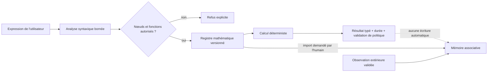

# Calculateur mathématique et mémoire à quatre niveaux

Cette extension sépare volontairement trois choses qui sont souvent mélangées :

1. le **catalogue** décrit les règles et fonctions autorisées ;
2. le **calculateur déterministe** exécute une expression dans un langage borné ;
3. la **mémoire associative** conserve seulement les règles importées et les observations dont la provenance est explicite.

Un calcul ordinaire n'est jamais réinjecté automatiquement. Cette séparation permet de lancer cent mille ou un million d'expressions sans créer autant de souvenirs.



## Pourquoi ce découpage

Les paramètres d'un modèle de langage sont utiles pour la langue, les analogies et la planification. Ils constituent un mauvais endroit pour recalculer ou mémoriser chaque table, constante et résultat. Le prototype teste une architecture hybride :

- un petit modèle peut comprendre la demande et choisir un outil ;
- le calculateur fournit le résultat reproductible ;
- la mémoire retrouve les règles, expériences et erreurs pertinentes ;
- les preuves extérieures déterminent ce qui peut être appris.

Cela peut réduire la quantité de faits à encoder dans les poids d'un futur modèle, mais ce dépôt ne démontre pas encore une réduction de paramètres. Cette hypothèse devra être mesurée contre des modèles comparables sur les mêmes tâches.

## Les quatre niveaux d'apprentissage

| Niveau | État | Exemple mathématique | Peut guider l'agent ? |
|---|---|---|---|
| 1 | Reçu | une nouvelle règle est proposée ou importée | non, elle est seulement répertoriée |
| 2 | Observé | des exemples possèdent un résultat extérieur connu | avec prudence et provenance |
| 3 | Consolidé | la règle réussit plusieurs cas indépendants et garde ses preuves | oui, comme connaissance confirmée |
| 4 | Opérationnel | l'algorithme passe les limites, tests différentiels et tests de sécurité | oui, dans le calculateur autorisé |

Le catalogue livré avec le code est du niveau 4 **dans le périmètre borné du prototype** : les fonctions sont des adaptateurs vers la bibliothèque standard Python et sont testées. Cette maturité ne signifie pas que toutes les mathématiques sont couvertes.

## Langage de calcul v1

Le moteur accepte des nombres, listes numériques bornées, parenthèses, constantes déclarées, opérateurs arithmétiques et appels directs à des fonctions du registre. Il refuse notamment :

- importation de modules et ouverture de fichiers ;
- accès à un attribut ou à un indice arbitraire ;
- fonctions anonymes, compréhensions et affectations ;
- nom ou fonction absent du registre ;
- arbre trop grand ou trop profond ;
- exposant, factorielle, combinaison, entier ou collection dépassant les quotas ;
- résultat complexe, infini ou non sérialisable.

Le moteur ne fait jamais appel à `eval`. L'arbre syntaxique est parcouru nœud par nœud et seules les opérations déclarées sont exécutées.

Exemples :

```text
2 + 3 * 4
sqrt(81)
gcd(84, 30)
comb(20, 3)
mean([12, 15, 18])
sin(pi / 2)
frac(1, 3) + frac(1, 6)
```

Dans la conversation locale, la forme bornée est aussi reconnue :

```text
Calcule 2 + 3 * 4
```

## Contrats HTTP locaux

```text
GET  /api/math/catalog
POST /api/calculate
POST /api/math/catalog/import
```

Exemple de requête :

```json
{
  "expression": "comb(20, 3) + sqrt(81)"
}
```

La réponse contient le résultat sérialisé, un affichage stable, son type, l'indication exact ou approché, les fonctions utilisées, le nombre d'opérations, la durée et la validation de la politique d'exécution. Cette trace prouve que l'AST, le registre et les quotas ont été respectés; elle n'est pas une comparaison avec un second moteur. Une erreur de domaine ou de quota retourne une erreur contrôlée ; elle ne fait pas tomber le serveur.

Un entier exact dépassant la plage sûre de JavaScript (`2^53 - 1`) est transmis comme chaîne décimale, y compris dans le numérateur ou le dénominateur d'une fraction. L'affichage reste donc exact après le passage par JSON.

L'import du catalogue est une action séparée et explicite. Il mémorise les descriptions/règles avec une clé idempotente dérivée de la version et du nom. Il ne mémorise aucun résultat produit par `/api/calculate`.

## Test à grande échelle

Le benchmark construit des familles d'expressions déterministes et calcule leur résultat attendu par un chemin indépendant. Il mesure exactitude, erreurs, débit et latences p50/p95/p99, puis vérifie quelques tentatives d'exécution interdites.

```bash
python scripts/benchmark_math.py --count 100000
python scripts/benchmark_math.py --count 1000000 --warmup 5000
```

Le rapport indique toujours `memory_writes: 0`. Cette propriété est essentielle : la taille de la mémoire dépend du nombre de règles et d'expériences utiles, pas du nombre total de calculs.

Les mesures locales reproductibles de la v0.4 se trouvent dans [BENCHMARK_MATH_V04.md](BENCHMARK_MATH_V04.md).

## Ce que « grande échelle » signifie ici

Le registre est compact : ajouter une fonction ajoute une description et un adaptateur, pas des millions de résultats. En revanche, un milliard d'expressions exige tout de même un milliard d'exécutions. Pour cette échelle, il faudra comparer :

- interprétation actuelle, utile pour la sécurité et l'explication ;
- compilation d'un arbre validé réutilisable ;
- évaluation vectorisée par lots ;
- répartition entre plusieurs processus ou machines ;
- cache uniquement pour les expressions pures, avec version du catalogue dans la clé.

Le premier benchmark sert de ligne de base. Il ne faut pas extrapoler linéairement une courte mesure locale à un milliard d'opérations.

## Étapes suivantes

1. ajouter des matrices et de l'algèbre symbolique dans un moteur isolé optionnel ;
2. définir un petit format d'algorithme composé avec boucles strictement bornées ;
3. tester chaque fonction contre un second moteur indépendant ;
4. enregistrer seulement les divergences, erreurs récurrentes et stratégies confirmées ;
5. comparer petit modèle seul, petit modèle + calculateur, petit modèle + RAG et petit modèle + mémoire.
