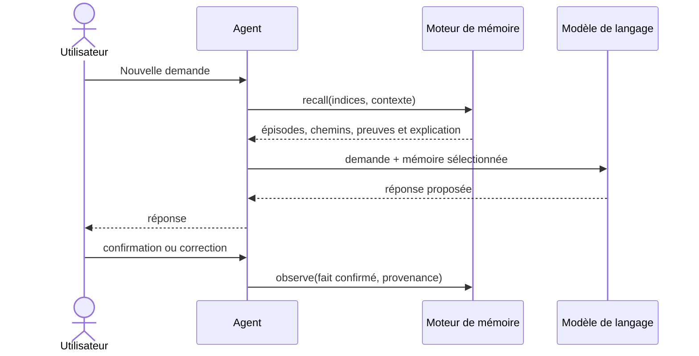
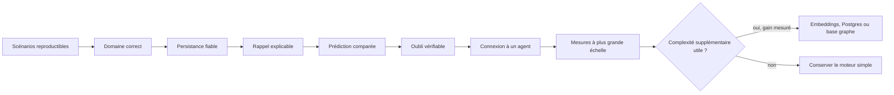

# Plan de création du moteur de mémoire pour agent

Ce plan vise un premier moteur petit, local, persistant et explicable. Le but n'est pas de construire immédiatement une « intelligence complète », mais de tester l'hypothèse centrale avec des résultats reproductibles.

## 1. Résultat attendu du MVP

À la fin du MVP, une application doit pouvoir :

1. enregistrer des épisodes et leurs occurrences ;
2. consolider des transitions entre concepts sans perdre les preuves ;
3. retrouver un épisode à partir d'indices incomplets ;
4. prédire la suite d'une séquence avec un historique et un contexte ;
5. expliquer chaque résultat ;
6. supprimer un événement et recalculer son influence ;
7. redémarrer sans perdre ni modifier la mémoire.

## 2. Périmètre fonctionnel

### Inclus

- concepts fournis explicitement ou par un extracteur simple ;
- portées, provenances, contextes, épisodes, événements, occurrences, motifs et continuations ;
- contexte typé, par exemple utilisateur et projet ;
- renforcement incrémental ;
- rappel borné ;
- prédiction à ordre variable ;
- provenance, explication et suppression ;
- API locale pour connecter un agent.

### Reporté après validation

- embeddings et recherche vectorielle ;
- extraction avancée d'entités par LLM ;
- interface graphique interactive ;
- base de graphes spécialisée ;
- déploiement distribué ;
- mémoire partagée entre organisations ;
- apprentissage neuronal différentiable ;
- suppression automatique des souvenirs anciens.

## 3. Choix techniques initiaux

| Besoin | Choix initial | Raison |
|---|---|---|
| Langage | Python 3.12 ou supérieur | prototypage rapide et écosystème de tests |
| Persistance | SQLite en mode WAL | local, transactionnel, facile à inspecter |
| API | FastAPI | contrats simples pour l'intégration d'agents |
| Validation | Pydantic | entrées et sorties explicites |
| Tests | pytest | scénarios reproductibles et tests de propriétés |
| Migrations | Alembic ou migrations SQL versionnées | évolution vérifiable du schéma |
| Visualisation exploratoire | NetworkX en outil de développement seulement | inspection sans en faire la base de stockage |

La base de données et l'API doivent rester derrière des interfaces afin de pouvoir remplacer SQLite ou HTTP sans réécrire le domaine.

## 4. Organisation proposée du futur dépôt de code

```text
memory-engine/
├── README.md
├── pyproject.toml
├── src/
│   └── memory_engine/
│       ├── domain/
│       │   ├── models.py
│       │   ├── relations.py
│       │   ├── patterns.py
│       │   └── policies.py
│       ├── application/
│       │   ├── observe.py
│       │   ├── recall.py
│       │   ├── predict.py
│       │   ├── explanations.py
│       │   └── forget.py
│       ├── storage/
│       │   ├── repository.py
│       │   └── sqlite.py
│       ├── scoring/
│       │   ├── decay.py
│       │   ├── activation.py
│       │   └── variable_order.py
│       └── api/
│           └── http.py
├── tests/
│   ├── unit/
│   ├── integration/
│   ├── properties/
│   └── scenarios/
├── benchmarks/
├── examples/
└── docs/
```

## 5. Contrats publics du MVP

### `observe`

Enregistre un événement ou une séquence. Exige une provenance et une clé d'idempotence.

```text
observe(scope, episode, events, context, provenance, idempotency_key)
→ event_ids, occurrence_ids, evidence_span_ids, updated_continuation_ids
```

### `recall`

Retrouve des épisodes à partir d'indices conceptuels, d'une fenêtre temporelle et d'une portée d'accès.

```text
recall(scope, cues, context, time_window, top_k, budget)
→ ranked_episodes, paths, evidence, score_components, explanation
```

### `predict`

Classe les prochains concepts possibles.

```text
predict(scope, history, context, top_k)
→ candidates, relative_scores, support, evidence, explanation
```

### `explain` interne

Compose le calcul exact inclus dans la même réponse qu'un rappel ou une prédiction. Le MVP ne promet pas de relire plus tard un `result_id` stocké.

```text
compose_explanation(candidate, score_components, evidence_spans)
→ algorithm_version, factors, paths, evidence_occurrences
```

### `forget`

Supprime réellement une source et reconstruit les agrégats concernés. La décroissance temporelle reste une politique de score, pas une opération d'effacement.

```text
forget(scope, selector)
→ affected_events, removed_evidence_spans, rebuilt_continuations
```

## 6. Jeux de scénarios de référence

Avant le code, créer des fichiers de données déterministes avec les réponses attendues.

### Scénario A — bifurcation par fréquence

```text
A → B → C   observé 8 fois
A → B → D   observé 2 fois
```

Attendu : après `A → B`, `C` est classé devant `D`, et les dix épisodes sont accessibles comme preuves.

### Scénario B — bifurcation par contexte

```text
contexte travail : A → B → C
contexte maison  : A → B → D
```

Attendu : la même histoire produit une prédiction différente selon le contexte, avec repli global explicite si le contexte est absent.

### Scénario C — rappel incomplet

```text
rapport → Atlas → PDF → validation → envoi
```

Attendu : les indices `Atlas + validation` retrouvent le bon épisode et son ordre.

### Scénario D — événement en retard

Un événement placé entre deux occurrences arrive après leur ingestion.

Attendu : l'ordre temporel, les motifs et les preuves locales sont corrigés, tandis que le journal d'ingestion reste auditable.

### Scénario E — cycle

```text
A → B → C → A
```

Attendu : rappel et propagation terminent dans le budget fixé et ne dupliquent pas indéfiniment le même chemin.

### Scénario F — suppression

Une observation ayant renforcé `B → C` est supprimée.

Attendu : son étendue de preuve disparaît, les compteurs diminuent exactement et aucune explication ne la cite ensuite.

### Scénario G — changement de régime

Une ancienne branche fréquente est remplacée par une nouvelle habitude.

Attendu : le support brut conserve l'histoire, mais le score avec décroissance finit par favoriser le nouveau régime.

## 7. Phases de réalisation

### Phase 0 — Figer la spécification expérimentale

**Travail**

- valider le glossaire concept/occurrence/épisode/motif ;
- décider comment commencent et se terminent les épisodes ;
- définir la portée d'autorisation, la provenance et les contextes autorisés au MVP ;
- définir l'ordre entre événements et la règle pour plusieurs concepts dans un même événement ;
- écrire les sept scénarios de référence ;
- définir les formats d'entrée et de sortie ;
- versionner la première formule de classement.

**Critères d'acceptation**

- chaque scénario possède des données et un résultat attendu non ambigu ;
- aucun score illustratif n'est présenté comme une probabilité ;
- les sources observées, inférées et générées sont distinguées ;
- le contexte est canonisé mais ne sert jamais de barrière d'autorisation.

**Livrable :** spécification v0.1 et fixtures JSON.

---

### Phase 1 — Construire le domaine en mémoire

**Travail**

- créer les modèles `Scope`, `Context`, `Provenance`, `Concept`, `Event`, `Episode`, `Occurrence`, `Pattern`, `PatternItem`, `Continuation` et `EvidenceSpan` ;
- implémenter la résolution de concepts par clé canonique ;
- créer les occurrences avec l'ordre des événements et l'ordinal interne explicite ;
- extraire les motifs de longueur `1..k_max`, leurs continuations et leurs étendues de preuve ;
- rendre l'ingestion idempotente ;
- fournir une inspection textuelle du graphe.

**Critères d'acceptation**

- ingérer deux fois la même clé dans la même portée ne double aucun compteur ni preuve ;
- répéter volontairement une séquence augmente son support ;
- deux épisodes partageant un concept conservent des occurrences distinctes ;
- un motif d'ordre 2 ou 3 peut être retrouvé sans reconstruire tout le journal ;
- tous les tests unitaires des invariants passent.

**Livrable :** bibliothèque Python sans base de données.

---

### Phase 2 — Ajouter la persistance SQLite

**Travail**

- créer le schéma et les migrations ;
- implémenter les dépôts de lecture/écriture ;
- encapsuler une ingestion complète dans une transaction ;
- activer les contraintes d'intégrité et les clés étrangères ;
- ajouter les unicités composites de portée, motif, continuation et étendue de preuve ;
- ajouter les index nécessaires ;
- tester redémarrage, concurrence légère et événements en retard.

**Critères d'acceptation**

- un redémarrage conserve exactement les épisodes, occurrences, motifs, continuations et preuves ;
- une ingestion interrompue ne laisse aucun agrégat partiel ;
- l'ordre des événements en retard est recalculé de façon déterministe ;
- une base corrompue ou une migration incompatible échoue clairement.

**Livrable :** mémoire locale persistante.

---

### Phase 3 — Implémenter rappel et explication

**Travail**

- résoudre les indices en concepts ;
- trouver les épisodes où plusieurs indices convergent ;
- effectuer un parcours borné à profondeur faible ;
- appliquer les pénalités de distance et de source ;
- composer la trace de calcul dans chaque réponse ;
- retourner les chemins, étendues de preuve et occurrences justificatives.

**Critères d'acceptation**

- le scénario de rappel incomplet retourne le bon épisode dans `top_k` ;
- le scénario cyclique termine toujours dans le budget ;
- 100 % des explications retournées désignent des preuves persistantes ;
- les mêmes données et paramètres donnent le même résultat ;
- chaque requête respecte strictement son budget, et la stabilité du classement est mesurée lorsque ce budget augmente.

**Livrable :** opération `recall` avec explication incluse.

---

### Phase 4 — Implémenter la prédiction à ordre variable

**Travail**

- indexer les motifs matérialisés de longueur 1 à `k_max` par hash de séquence ;
- sélectionner le suffixe le plus long ayant assez de support ;
- appliquer contexte, récence et lissage ;
- produire des alternatives et un repli explicite ;
- comparer aux baselines Markov-1 et Markov-2.

**Critères d'acceptation**

- la branche majoritaire gagne dans le scénario de fréquence ;
- la branche du bon contexte gagne dans le scénario contextuel ;
- une branche rare reste visible quand `top_k` le permet ;
- chaque candidat indique le motif utilisé, son nombre de preuves et son nombre d'épisodes distincts ;
- les résultats sont reproductibles avec la même version de calcul.

**Livrable :** opération `predict` et rapport de comparaison.

---

### Phase 5 — Implémenter l'oubli et la correction

**Travail**

- ajouter la décroissance avec une ancre `decay_updated_at` reproductible ;
- implémenter la suppression transactionnelle par événement ou épisode ;
- recalculer les continuations touchées à partir des étendues de preuve restantes ;
- interdire les preuves supprimées dans les caches et explications ;
- tester une fusion ou correction réversible de concepts.

**Critères d'acceptation**

- le scénario de changement de régime favorise progressivement la nouvelle habitude ;
- la suppression retire exactement l'influence de la source ciblée ;
- supprimer puis reconstruire produit les mêmes agrégats qu'une base créée sans l'événement ;
- aucune donnée supprimée ne reste dans les journaux applicatifs.

**Livrable :** opération `forget` et tests d'effacement.

---

### Phase 6 — Exposer l'API et connecter un agent

**Travail**

- exposer `observe`, `recall`, `predict` et `forget`, avec explication incluse dans les lectures ;
- ajouter une authentification locale ou une portée d'agent ;
- créer un adaptateur simple avant et après un appel de modèle ;
- définir quand l'agent peut écrire, lire et confirmer un souvenir ;
- ajouter des journaux techniques sans contenu sensible.



**Critères d'acceptation**

- une sortie générée n'est jamais enregistrée comme fait avant confirmation ;
- la portée d'un agent ne permet pas de lire celle d'un autre ;
- chaque injection de mémoire dans le modèle peut être auditée ;
- l'agent fonctionne encore si la mémoire est temporairement indisponible.

**Livrable :** service local et exemple d'intégration d'agent.

---

### Phase 7 — Mesurer et décider de la suite

**Travail**

- produire 100 000 occurrences synthétiques reproductibles ;
- mesurer qualité, latence et croissance ;
- comparer aux baselines ;
- tester bruit, concepts populaires, empoisonnement et dérive ;
- décider si les embeddings, PostgreSQL ou une base graphe apportent un gain mesuré.

**Critères indicatifs à confirmer sur une machine documentée**

- prédiction : latence p95 inférieure à 100 ms sur 100 000 occurrences ;
- rappel borné : latence p95 inférieure à 300 ms ;
- aucune explication sans preuve valide ;
- aucune fuite de portée dans les tests d'isolation ;
- croissance du nombre de motifs et de continuations mesurée et plafonnée par politique.

**Livrable :** rapport d'évaluation et décision go/no-go pour la v1.

## 8. Stratégie de tests

### Tests unitaires

- renforcement et décroissance ;
- normalisation de concepts ;
- ordre des occurrences ;
- calcul des composantes de score ;
- sélection du motif d'historique ;
- règles de budget du parcours.

### Tests de propriétés

- les supports bruts ne sont jamais négatifs ;
- une continuation sans étendue de preuve n'existe pas ;
- réingérer la même clé dans la même portée est sans effet ;
- le rappel respecte toujours profondeur et `top_k` ;
- toute preuve appartient à la portée autorisée ;
- supprimer toutes les preuves supprime la continuation ;
- deux continuations identiques dans la même portée, le même contexte et le même motif ne peuvent pas être créées par un retry.

### Tests d'intégration

- transaction complète d'ingestion ;
- redémarrage ;
- migrations ;
- événement en retard ;
- suppression et reconstruction ;
- appels API concurrents légers.

### Tests adversariaux

- répétition massive d'une fausse séquence ;
- concept hub relié à presque tout ;
- cycles courts et longs ;
- entrée hors portée ;
- source générée essayant de se déclarer observée ;
- payload très volumineux ou mal formé.

## 9. Mesures d'évaluation

| Capacité | Mesures |
|---|---|
| Prédiction | Hit@1, Hit@3, MRR, couverture et support moyen |
| Rappel | Recall@k, MRR et taux de convergence des indices |
| Explication | proportion de résultats entièrement soutenus par des occurrences |
| Performance | latence p50/p95, mémoire vive et taille disque |
| Croissance | motifs et continuations par occurrence, concepts orphelins et taux de consolidation |
| Oubli | temps de suppression et égalité après reconstruction |
| Isolation | nombre de fuites de portée, attendu : zéro |

Si des probabilités calibrées sont ajoutées, mesurer aussi Brier score ou log loss. Avant cela, parler uniquement de scores relatifs.

## 10. Baselines obligatoires

Le prototype doit être meilleur sur au moins un besoin mesuré, et pas seulement plus complexe. Le comparer à :

1. dernier élément ou candidat le plus fréquent ;
2. Markov d'ordre 1 ;
3. Markov d'ordre 2 ;
4. recherche épisodique chronologique simple ;
5. recherche vectorielle seule, seulement lorsque les embeddings seront introduits.

## 11. Principaux risques et parades

| Risque | Parade MVP |
|---|---|
| Mélange concept/occurrence | objets et tables séparés dès la première migration |
| Explosion combinatoire | uniquement relations autorisées, pas toutes les cooccurrences possibles |
| Fausse confiance | score décomposé, support brut et avertissement de faible preuve |
| Boucle d'activation | profondeur, énergie, nœuds, temps et revisites bornés |
| Contamination par le modèle | statuts de provenance et confirmation obligatoire |
| Contextes incompatibles | clés typées et repli annoncé |
| Suppression impossible | étendues de preuve par événement et reconstruction testée |
| Concept mal fusionné | alias auditables et fusion réversible |
| Surarchitecture | SQLite et algorithmes simples jusqu'à mesure contraire |

## 12. Liste initiale d'issues GitHub

- [ ] Définir le schéma JSON des sept scénarios de référence.
- [ ] Documenter la frontière d'un épisode.
- [ ] Formaliser portée, provenance et canonisation du contexte.
- [ ] Décider l'ordre des concepts appartenant au même événement.
- [ ] Implémenter les modèles du domaine.
- [ ] Ajouter l'ingestion idempotente en mémoire.
- [ ] Ajouter les motifs à ordre variable et leurs continuations.
- [ ] Ajouter les étendues de preuve traçables.
- [ ] Créer le schéma SQLite et la première migration.
- [ ] Implémenter le rappel borné.
- [ ] Implémenter l'explication fidèle.
- [ ] Implémenter Markov-1 et Markov-2 comme baselines.
- [ ] Implémenter la prédiction à ordre variable.
- [ ] Ajouter la décroissance temporelle.
- [ ] Ajouter la suppression forte avec reconstruction.
- [ ] Exposer l'API locale.
- [ ] Créer l'exemple d'intégration avec un agent.
- [ ] Construire le benchmark de 100 000 occurrences.
- [ ] Publier le premier rapport d'évaluation.

## 13. Ordre recommandé de décision



La première preuve de valeur n'est pas une démonstration spectaculaire. C'est un moteur capable d'apprendre deux chemins concurrents, de choisir le bon selon le contexte, de montrer exactement pourquoi, puis de corriger son choix lorsqu'une preuve est supprimée.
