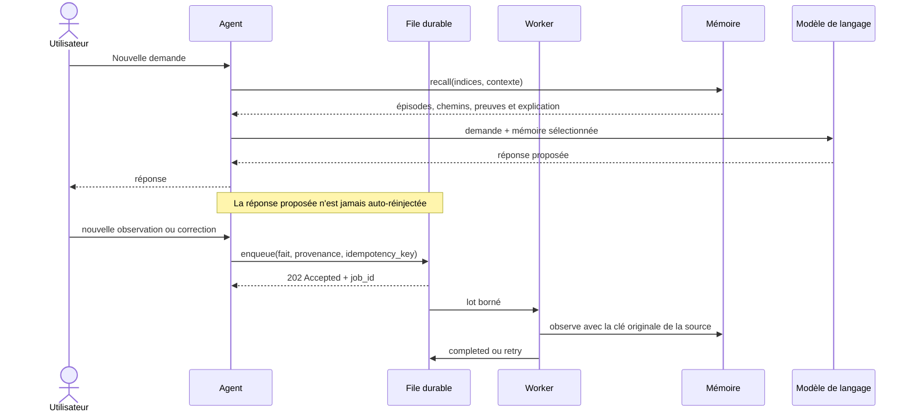
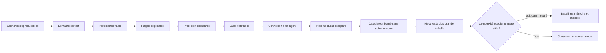

# Plan de création du moteur de mémoire pour agent

Ce plan vise un premier moteur petit, local, persistant et explicable. La v0.3 a séparé l'injection, la consolidation et la lecture; la v0.4 ajoute une calculatrice déterministe et un catalogue de règles importable explicitement; la v0.5 ajoute une vérité historique indépendante et un laboratoire de stress calculable; la v0.6 ajoute un hub indépendant capable de servir plusieurs IA locales. Le but n'est pas de construire immédiatement une « intelligence complète », mais de tester les hypothèses centrales avec des résultats reproductibles.

## 1. Résultat attendu du MVP

À la fin du MVP, une application doit pouvoir :

1. enregistrer des épisodes et leurs occurrences ;
2. consolider des transitions entre concepts sans perdre les preuves ;
3. retrouver un épisode à partir d'indices incomplets ;
4. prédire la suite d'une séquence avec un historique et un contexte ;
5. expliquer chaque résultat ;
6. supprimer un événement et recalculer son influence ;
7. redémarrer sans perdre ni modifier la mémoire ;
8. prévisualiser puis importer un objet ou tableau JSON avec catégories et provenance ;
9. accepter rapidement une observation avec `HTTP 202` et un ticket durable ;
10. consolider cette observation en arrière-plan puis exposer son état ;
11. continuer à lire la mémoire pendant que le worker écrit ;
12. reprendre un travail interrompu sans doubler l'apprentissage ;
13. calculer une expression autorisée avec un résultat typé, une durée et une validation de politique ;
14. garantir qu'un calcul ordinaire n'écrit rien dans la mémoire ;
15. inspecter puis importer explicitement et idempotemment les règles du catalogue mathématique.
16. générer une chronique historique reproductible avec dates, contextes, doublons et contradictions ;
17. calculer les 11 familles historiques autorisées lorsque leurs entrées existent, avec unités et lignage ;
18. évaluer automatiquement la mémoire dans des bases temporaires sans modifier la mémoire principale ;
19. séparer le score sémantique des diagnostics de plomberie et ne produire aucun score si le pipeline est incomplet.
20. isoler physiquement les espaces privés, partagés et de référence de plusieurs agents ;
21. produire une capsule JSON neutre, déterministe, dédupliquée et bornée ;
22. refuser qu'une sortie générée se transforme seule en observation fiable ;
23. comparer chaque empreinte de modèle local avec et sans la même capsule, sans modifier les modèles installés.

## 2. Périmètre fonctionnel

### Inclus

- concepts fournis explicitement ou par un extracteur simple ;
- portées, provenances, contextes, épisodes, événements, occurrences, motifs et continuations ;
- contexte typé, par exemple utilisateur et projet ;
- renforcement incrémental ;
- rappel borné ;
- prédiction à ordre variable ;
- provenance, explication et suppression ;
- API locale pour connecter un agent.
- import JSON local avec validation, aperçu et confirmation explicite.
- file SQLite d'injection séparée de la base mémoire ;
- consolidation par lots bornés dans un worker d'arrière-plan ;
- connexions de lecture et d'écriture distinctes vers la mémoire ;
- tickets, retard de file et métriques de dédoublonnage et de taille ;
- interdiction de réinjecter automatiquement une réponse générée.
- langage d'expressions mathématiques borné et registre de fonctions versionné ;
- résultats exacts ou approchés, métriques d'exécution et validation de politique ;
- import explicite des descriptions du catalogue, séparé de l'exécution des calculs ;
- quatre niveaux distingués : reçu, observé, consolidé et opérationnel.
- oracle historique indépendant du tokenizer et du classement de la mémoire ;
- 11 familles historiques déterministes : trois durées civiles, milieu temporel, âge, intervalle, conversion, deux variations, taux annuel et distance ;
- conservation opaque des mesures à unité inconnue, avec dérivation sautée plutôt que valeur devinée ;
- scénario de stress isolé avec score sémantique, diagnostic de plomberie, déduplication, latence, débit et stockage ;
- verrou de score exigeant une file vidée, aucun échec et le compte exact de travaux terminés.
- Memory Hub multi-IA avec politiques `private`, `shared` et `reference` ;
- capsules de rappel bornées avec provenance, explication et suppression des doublons ;
- corpus scientifique tenu séparé de sa grille d'évaluation ;
- banc Ollama local limité à la boucle locale, exécuté un modèle à la fois et
  dédupliqué par empreinte.

### Reporté après validation

- embeddings et recherche vectorielle ;
- extraction avancée d'entités par LLM ;
- interface graphique interactive ;
- base de graphes spécialisée ;
- déploiement distribué ;
- mémoire partagée entre organisations ;
- apprentissage neuronal différentiable ;
- suppression automatique des souvenirs anciens.
- exécution de code arbitraire ou système d'algèbre symbolique général.

## 3. Choix techniques initiaux

| Besoin | Choix initial | Raison |
|---|---|---|
| Langage | Python 3.11 ou supérieur | compatibilité déclarée dans `pyproject.toml` et bibliothèque standard suffisante |
| Persistance | SQLite en mode WAL | local, transactionnel, facile à inspecter |
| Durabilité des mutations | `synchronous=FULL` pour la file et l'écrivain mémoire | un acquittement durable ne doit pas devancer la mutation qu'il confirme |
| File d'injection | second fichier SQLite | acceptation rapide, reprise après arrêt et isolation du journal de travaux |
| Consolidation | worker unique, lots bornés | apprentissage hors du temps de réponse et comportement mesurable |
| Lecture | connexion `MemoryEngine` distincte | disponibilité du rappel pendant les écritures WAL |
| API | `http.server` de la bibliothèque standard | prototype local sans dépendance; FastAPI reste une option future |
| Validation | fonctions déterministes et dataclasses | entrées bornées sans dépendance externe |
| Calcul mathématique | parcours explicite d'un AST autorisé + registre versionné | résultat reproductible sans `eval` ni écriture mémoire automatique |
| Tests | `unittest` | scénarios reproductibles fournis par Python |
| Migrations | version de schéma SQLite vérifiée explicitement | refus d'une version inconnue plutôt qu'une migration implicite |
| Visualisation exploratoire | Mermaid et interface locale | inspection sans ajouter de moteur graphe |

La base de données et l'API doivent rester derrière des interfaces afin de pouvoir remplacer SQLite ou HTTP sans réécrire le domaine.

## 4. Organisation proposée du futur dépôt de code

```text
memory-engine/
├── README.md
├── pyproject.toml
├── src/
│   └── memory_engine/
│       ├── domain/
│       │   ├── models.py
│       │   ├── relations.py
│       │   ├── patterns.py
│       │   └── policies.py
│       ├── application/
│       │   ├── observe.py
│       │   ├── recall.py
│       │   ├── predict.py
│       │   ├── calculate.py
│       │   ├── explanations.py
│       │   └── forget.py
│       ├── storage/
│       │   ├── repository.py
│       │   └── sqlite.py
│       ├── scoring/
│       │   ├── decay.py
│       │   ├── activation.py
│       │   └── variable_order.py
│       ├── math/
│       │   ├── catalog.py
│       │   ├── evaluator.py
│       │   └── limits.py
│       └── api/
│           └── http.py
├── tests/
│   ├── unit/
│   ├── integration/
│   ├── properties/
│   └── scenarios/
├── benchmarks/
│   ├── pipeline.py
│   └── math.py
├── examples/
└── docs/
```

## 5. Contrats publics du MVP

### `observe`

Enregistre un événement ou une séquence. Exige une provenance et une clé d'idempotence.

```text
observe(scope, episode, events, context, provenance, idempotency_key)
→ event_ids, occurrence_ids, evidence_span_ids, updated_continuation_ids
```

En v0.3, l'API HTTP asynchrone n'appelle pas directement ce contrat : elle place d'abord l'observation dans la file, puis le worker appelle `observe`.

### `enqueue` et tickets v0.3

```text
enqueue(text, episode_id, context, provenance, idempotency_key)
→ job_id, sequence, state, created, duplicate, enqueued_at

GET /api/pipeline/jobs/<job_id>
→ state, attempts, completed_at, last_error, résultat technique expurgé
```

Une création acceptée répond `HTTP 202`. Le ticket confirme la durabilité dans la file, pas encore la visibilité dans `recall`. Rejouer la même clé et le même payload retrouve le ticket; réutiliser la clé pour un autre payload est un conflit.

### `recall`

Retrouve des épisodes à partir d'indices conceptuels, d'une fenêtre temporelle et d'une portée d'accès.

```text
recall(scope, cues, context, time_window, top_k, budget)
→ ranked_episodes, paths, evidence, score_components, explanation
```

### `predict`

Classe les prochains concepts possibles.

```text
predict(scope, history, context, top_k)
→ candidates, relative_scores, support, evidence, explanation
```

### `explain` interne

Compose le calcul exact inclus dans la même réponse qu'un rappel ou une prédiction. Le MVP ne promet pas de relire plus tard un `result_id` stocké.

```text
compose_explanation(candidate, score_components, evidence_spans)
→ algorithm_version, factors, paths, evidence_occurrences
```

### `forget`

Supprime réellement une source et reconstruit les agrégats concernés. La décroissance temporelle reste une politique de score, pas une opération d'effacement.

```text
forget(scope, selector)
→ affected_events, removed_evidence_spans, rebuilt_continuations
```

### `calculate` et catalogue v0.4

```text
POST /api/calculate
{ "expression": "comb(20, 3) + sqrt(81)" }
→ result, display, result_type, exact, duration_ms,
  functions_used, operations_count, verification

GET /api/math/catalog
→ version, count, categories, functions

POST /api/math/catalog/import
→ HTTP 202, catalog_version, queued_count, duplicate_count, job_ids
```

`calculate` valide puis parcourt un AST borné et n'appelle jamais `observe` ou `enqueue`. Son résultat reste éphémère. L'import du catalogue est une action distincte : chaque règle reçoit une clé idempotente dérivée de la version et de son nom stable, puis suit le pipeline normal. Une commande conversationnelle `Calcule ...` délègue au même moteur et conserve la même garantie d'absence d'écriture.

### Niveaux d'apprentissage

| Niveau | Condition | Usage permis |
|---|---|---|
| Reçu | contenu accepté ou répertorié | aucun guidage fiable |
| Observé | preuve extérieure ou action exécutée avec provenance | preuve contextualisée |
| Consolidé | motif soutenu par plusieurs preuves traçables | rappel et classement |
| Opérationnel | règle déterministe testée, versionnée et bornée | exécution dans le calculateur autorisé |

Un résultat opérationnel n'est pas automatiquement une observation. Il ne rejoint la mémoire que s'il revient comme donnée extérieure indépendante selon les règles de provenance.

## 6. Jeux de scénarios de référence

Avant le code, créer des fichiers de données déterministes avec les réponses attendues.

### Scénario A — bifurcation par fréquence

```text
A → B → C   observé 8 fois
A → B → D   observé 2 fois
```

Attendu : après `A → B`, `C` est classé devant `D`, et les dix épisodes sont accessibles comme preuves.

### Scénario B — bifurcation par contexte

```text
contexte travail : A → B → C
contexte maison  : A → B → D
```

Attendu : la même histoire produit une prédiction différente selon le contexte, avec repli global explicite si le contexte est absent.

### Scénario C — rappel incomplet

```text
rapport → Atlas → PDF → validation → envoi
```

Attendu : les indices `Atlas + validation` retrouvent le bon épisode et son ordre.

### Scénario D — événement en retard

Un événement placé entre deux occurrences arrive après leur ingestion.

Attendu : l'ordre temporel, les motifs et les preuves locales sont corrigés, tandis que le journal d'ingestion reste auditable.

### Scénario E — cycle

```text
A → B → C → A
```

Attendu : rappel et propagation terminent dans le budget fixé et ne dupliquent pas indéfiniment le même chemin.

### Scénario F — suppression

Une observation ayant renforcé `B → C` est supprimée.

Attendu : son étendue de preuve disparaît, les compteurs diminuent exactement et aucune explication ne la cite ensuite.

### Scénario G — changement de régime

Une ancienne branche fréquente est remplacée par une nouvelle habitude.

Attendu : le support brut conserve l'histoire, mais le score avec décroissance finit par favoriser le nouveau régime.

### Scénario H — calcul exact et approché sans mémoire

Évaluer des expressions arithmétiques, rationnelles et transcendantes autorisées, puis vérifier indépendamment les résultats et leur drapeau exact/approché.

Attendu : résultats reproductibles dans les tolérances déclarées, trace de validation présente et compteurs mémoire/file inchangés après les calculs. Le scénario de test, contrairement à un calcul ordinaire, compare aussi avec un résultat attendu indépendant.

### Scénario I — expression interdite ou hors quota

Soumettre un import de module, un accès à un attribut, une fonction inconnue, un exposant excessif et un arbre trop profond.

Attendu : erreur contrôlée et bornée, aucune exécution arbitraire, aucune écriture et serveur toujours disponible.

### Scénario J — import explicite du catalogue

Importer deux fois la même version du catalogue.

Attendu : la première action crée ou remet en file les règles nécessaires; la seconde retrouve les mêmes tickets sans renforcer les preuves ni importer aucun résultat de calcul.

## 7. Phases de réalisation

### Phase 0 — Figer la spécification expérimentale

**Travail**

- valider le glossaire concept/occurrence/épisode/motif ;
- décider comment commencent et se terminent les épisodes ;
- définir la portée d'autorisation, la provenance et les contextes autorisés au MVP ;
- définir l'ordre entre événements et la règle pour plusieurs concepts dans un même événement ;
- écrire les sept scénarios de référence ;
- définir les formats d'entrée et de sortie ;
- définir le contrat d'import JSON, ses catégories heuristiques et ses limites ;
- versionner la première formule de classement.

**Critères d'acceptation**

- chaque scénario possède des données et un résultat attendu non ambigu ;
- aucun score illustratif n'est présenté comme une probabilité ;
- les sources observées, inférées et générées sont distinguées ;
- le contexte est canonisé mais ne sert jamais de barrière d'autorisation.

**Livrable :** spécification v0.1 et fixtures JSON.

---

### Phase 1 — Construire le domaine en mémoire

**Travail**

- créer les modèles `Scope`, `Context`, `Provenance`, `Concept`, `Event`, `Episode`, `Occurrence`, `Pattern`, `PatternItem`, `Continuation` et `EvidenceSpan` ;
- implémenter la résolution de concepts par clé canonique ;
- créer les occurrences avec l'ordre des événements et l'ordinal interne explicite ;
- extraire les motifs de longueur `1..k_max`, leurs continuations et leurs étendues de preuve ;
- rendre l'ingestion idempotente ;
- fournir une inspection textuelle du graphe.

**Critères d'acceptation**

- ingérer deux fois la même clé dans la même portée ne double aucun compteur ni preuve ;
- répéter volontairement une séquence augmente son support ;
- deux épisodes partageant un concept conservent des occurrences distinctes ;
- un motif d'ordre 2 ou 3 peut être retrouvé sans reconstruire tout le journal ;
- tous les tests unitaires des invariants passent.

**Livrable :** bibliothèque Python sans base de données.

---

### Phase 2 — Ajouter la persistance SQLite

**Travail**

- créer le schéma et les migrations ;
- implémenter les dépôts de lecture/écriture ;
- encapsuler une ingestion complète dans une transaction ;
- activer les contraintes d'intégrité et les clés étrangères ;
- ajouter les unicités composites de portée, motif, continuation et étendue de preuve ;
- ajouter les index nécessaires ;
- tester redémarrage, concurrence légère et événements en retard.

**Critères d'acceptation**

- un redémarrage conserve exactement les épisodes, occurrences, motifs, continuations et preuves ;
- une ingestion interrompue ne laisse aucun agrégat partiel ;
- l'ordre des événements en retard est recalculé de façon déterministe ;
- une base corrompue ou une migration incompatible échoue clairement.

**Livrable :** mémoire locale persistante.

---

### Phase 3 — Implémenter rappel et explication

**Travail**

- résoudre les indices en concepts ;
- trouver les épisodes où plusieurs indices convergent ;
- effectuer un parcours borné à profondeur faible ;
- appliquer les pénalités de distance et de source ;
- composer la trace de calcul dans chaque réponse ;
- retourner les chemins, étendues de preuve et occurrences justificatives.

**Critères d'acceptation**

- le scénario de rappel incomplet retourne le bon épisode dans `top_k` ;
- le scénario cyclique termine toujours dans le budget ;
- 100 % des explications retournées désignent des preuves persistantes ;
- les mêmes données et paramètres donnent le même résultat ;
- chaque requête respecte strictement son budget, et la stabilité du classement est mesurée lorsque ce budget augmente.

**Livrable :** opération `recall` avec explication incluse.

---

### Phase 4 — Implémenter la prédiction à ordre variable

**Travail**

- indexer les motifs matérialisés de longueur 1 à `k_max` par hash de séquence ;
- sélectionner le suffixe le plus long ayant assez de support ;
- appliquer contexte, récence et lissage ;
- produire des alternatives et un repli explicite ;
- comparer aux baselines Markov-1 et Markov-2.

**Critères d'acceptation**

- la branche majoritaire gagne dans le scénario de fréquence ;
- la branche du bon contexte gagne dans le scénario contextuel ;
- une branche rare reste visible quand `top_k` le permet ;
- chaque candidat indique le motif utilisé, son nombre de preuves et son nombre d'épisodes distincts ;
- les résultats sont reproductibles avec la même version de calcul.

**Livrable :** opération `predict` et rapport de comparaison.

---

### Phase 5 — Implémenter l'oubli et la correction

**Travail**

- ajouter la décroissance avec une ancre `decay_updated_at` reproductible ;
- implémenter la suppression transactionnelle par événement ou épisode ;
- recalculer les continuations touchées à partir des étendues de preuve restantes ;
- interdire les preuves supprimées dans les caches et explications ;
- tester une fusion ou correction réversible de concepts.

**Critères d'acceptation**

- le scénario de changement de régime favorise progressivement la nouvelle habitude ;
- la suppression retire exactement l'influence de la source ciblée ;
- supprimer puis reconstruire produit les mêmes agrégats qu'une base créée sans l'événement ;
- aucune donnée supprimée ne reste dans les journaux applicatifs.

**Livrable :** opération `forget` et tests d'effacement.

---

### Phase 6 — Exposer l'API et connecter un agent

**Travail**

- exposer `observe`, `recall`, `predict` et `forget`, avec explication incluse dans les lectures ;
- ajouter une authentification locale ou une portée d'agent ;
- créer un adaptateur simple avant et après un appel de modèle ;
- définir quand l'agent peut écrire, lire et confirmer un souvenir ;
- ajouter des journaux techniques sans contenu sensible.
- exposer `POST /api/import` avec les modes `preview` et `commit` ;
- parcourir objets et tableaux en conservant un chemin JSON stable ;
- catégoriser les propositions par règles déterministes et afficher leur résumé avant confirmation ;
- rendre le rejeu idempotent avec l'empreinte du document et le chemin de chaque valeur ;
- appliquer les limites de taille, profondeur, nœuds, souvenirs et longueur de texte.
- créer `injection.sqlite3`, séparé de `memory.sqlite3`, avec les états `pending`, `processing`, `completed` et `failed` ;
- répondre `HTTP 202 Accepted` avec des tickets pour les souvenirs et commits JSON asynchrones ;
- consolider les tickets par lots bornés avec retry exponentiel et récupération après interruption ;
- ouvrir un `MemoryEngine` écrivain pour le worker et un `MemoryEngine` lecteur pour les questions ;
- exposer `GET /api/pipeline` et `GET /api/pipeline/jobs/<job_id>` sans republier le texte du souvenir ;
- publier le retard, le dédoublonnage et les tailles mémoire/file incluant DB, WAL et SHM ;
- créer les runs synthétiques et tous leurs tickets dans une seule transaction durable ;
- confier au serveur la détection de fin, l'oubli, la purge et la reprise du nettoyage, sans dépendre de l'onglet ;
- conserver après purge un bilan de run persistant, sans texte synthétique ;
- exécuter les observations, oublis et nettoyages par le writer mémoire configuré en `synchronous=FULL` ;
- fournir le lancement expérimental `python start_agent.py --async-injection`.



**Critères d'acceptation**

- une sortie générée n'est jamais automatiquement replacée dans la file, même comme hypothèse ;
- seule une nouvelle observation extérieure, une action exécutée ou une confirmation explicite peut déclencher `enqueue` ;
- la portée d'un agent ne permet pas de lire celle d'un autre ;
- chaque injection de mémoire dans le modèle peut être auditée ;
- l'agent fonctionne encore si la mémoire est temporairement indisponible.
- l'aperçu JSON n'écrit rien et une confirmation portant sur des données modifiées est refusée ;
- le même fichier réimporté ne duplique pas les souvenirs déjà créés ;
- un document invalide, trop profond ou trop volumineux échoue sans écriture partielle ;
- chaque souvenir importé peut être relié à son import et à son chemin JSON.
- un commit JSON asynchrone répond `202` avec un ticket par feuille et devient rappelable après consolidation ;
- un arrêt entre l'écriture mémoire et l'acquittement ne crée pas un second événement au retry ;
- le lecteur reste disponible pendant qu'un appel d'écriture du worker est bloqué ;
- les tickets publics n'exposent ni texte, ni contexte, ni provenance.
- un run de test est entièrement créé ou absent, jamais partiel ;
- fermer l'onglet pendant le test n'abandonne aucun souvenir synthétique ;
- un redémarrage reprend un nettoyage interrompu jusqu'à l'état `cleaned` ;
- les événements et tickets du test disparaissent, mais son bilan final reste auditable sans leur contenu.

**Livrable :** service local et exemple d'intégration d'agent.

---

### Phase 6b — Séparer le calcul déterministe de la mémoire

**Travail**

- définir un catalogue versionné de constantes, opérateurs et fonctions pures ;
- analyser les expressions par AST et autoriser explicitement chaque type de nœud ;
- borner longueur, profondeur, opérations, exposants, collections, entiers et résultats ;
- retourner valeur sérialisable, affichage stable, type, exactitude, durée, fonctions utilisées et validation de politique ;
- exposer `GET /api/math/catalog`, `POST /api/calculate` et `POST /api/math/catalog/import` ;
- reconnaître la commande conversationnelle `Calcule ...` sans passer par la mémoire ;
- garantir par test que le catalogue consulté et tous les calculs laissent mémoire et file inchangées ;
- rendre l'import des seules règles explicite, idempotent et observable par tickets ;
- fournir `scripts/benchmark_math.py` sans publier de mesure hors de son contexte d'exécution ;
- documenter le langage, ses limites et les quatre niveaux dans `docs/CALCULATEUR_MATHEMATIQUE.md`.

**Critères d'acceptation**

- aucune syntaxe non déclarée ne peut exécuter du code, lire un fichier ou accéder au réseau ;
- chaque erreur de syntaxe, domaine ou quota est contrôlée et bornée ;
- une expression et une version de catalogue identiques produisent le même résultat déterministe dans le domaine exact, ou respectent la tolérance déclarée dans le domaine approché ;
- cent, cent mille ou davantage de calculs n'ajoutent aucun événement ni ticket par eux-mêmes ;
- seul l'import explicite du catalogue crée des tickets, sans inclure les exemples de résultats ;
- réimporter la même version ne renforce pas une deuxième fois les mêmes règles ;
- le benchmark rapporte exactitude, erreurs, débit, latences p50/p95/p99 et `memory_writes`, sans chiffre codé dans la documentation.

**Livrable :** calculatrice v0.4, catalogue inspectable, import explicite et benchmark reproductible.

---

### Phase 6c — Évaluer la mémoire historique calculable

**Travail**

- construire une vérité de référence indépendante du tokenizer, du classement et des tables de la mémoire ;
- exposer un catalogue fini de 11 familles de calcul historique ;
- conserver les unités inconnues comme données opaques et marquer leurs calculs comme sautés ;
- injecter les faits sources comme `observed` et les dérivations comme `inferred` dans des bases temporaires ;
- générer des questions naturelles contrôlées sur les dates, états récents, contextes et contradictions ;
- réserver les marqueurs exacts au diagnostic du câblage index → épisode ;
- interdire tout score tant que le pipeline n'est pas intégralement terminé sans échec.

**Critères d'acceptation**

- le rapport distingue explicitement `semantic` et `plumbing_diagnostics` ;
- les marqueurs synthétiques ne participent jamais au score sémantique ;
- une contradiction exige ses deux épisodes dans le top 5 et n'est pas comptée au top 1 ;
- un pipeline non vidé, un ticket échoué ou un compte de travaux incorrect produit `status: incomplete`, `retrieval.status: not_scored` et des pourcentages `null` ;
- les faits et tickets de test restent dans le répertoire temporaire, qui est supprimé après fermeture des bases ;
- les résultats de machine sont publiés avec leur configuration et sans extrapolation à grande échelle.

**Livrable :** laboratoire historique v0.5, documentation du format et benchmark reproductible honnête.

---

### Phase 7 — Mesurer et décider de la suite

**Travail**

- produire 100 000 occurrences synthétiques reproductibles ;
- mesurer qualité, latence et croissance ;
- mesurer séparément latence d'acceptation, débit du worker, retard de file et latence de lecture pendant consolidation ;
- mesurer soumissions reçues, dédoublonnées, conflits d'idempotence et taille disque complète ;
- comparer aux baselines ;
- tester bruit, concepts populaires, empoisonnement et dérive ;
- décider si les embeddings, PostgreSQL ou une base graphe apportent un gain mesuré.

**Critères indicatifs à confirmer sur une machine documentée**

- prédiction : latence p95 inférieure à 100 ms sur 100 000 occurrences ;
- rappel borné : latence p95 inférieure à 300 ms ;
- aucune explication sans preuve valide ;
- aucune fuite de portée dans les tests d'isolation ;
- croissance du nombre de motifs et de continuations mesurée et plafonnée par politique.
- aucun ticket accepté perdu après redémarrage et aucun double renforcement après retry ;
- latences p50/p95/p99 d'acceptation et de lecture rapportées avec le débit et le retard du worker ;
- tailles de `injection.sqlite3` et `memory.sqlite3` rapportées séparément.

**Livrable :** rapport d'évaluation et décision go/no-go pour la v1.

## 8. Stratégie de tests

### Tests unitaires

- renforcement et décroissance ;
- normalisation de concepts ;
- ordre des occurrences ;
- calcul des composantes de score ;
- sélection du motif d'historique ;
- règles de budget du parcours ;
- transitions d'état et budget fini d'essais d'un ticket ;
- conflit lorsqu'une clé d'idempotence désigne un payload différent ;
- calcul du taux de dédoublonnage, du retard et des tailles DB/WAL/SHM.
- validation de l'AST mathématique, quotas et registre de fonctions ;
- sérialisation stable des entiers, fractions et valeurs approchées ;
- méthode de validation de politique et comptage des opérations.

### Tests de propriétés

- les supports bruts ne sont jamais négatifs ;
- une continuation sans étendue de preuve n'existe pas ;
- réingérer la même clé dans la même portée est sans effet ;
- le rappel respecte toujours profondeur et `top_k` ;
- toute preuve appartient à la portée autorisée ;
- supprimer toutes les preuves supprime la continuation ;
- deux continuations identiques dans la même portée, le même contexte et le même motif ne peuvent pas être créées par un retry.
- une soumission dédoublonnée ne crée ni nouveau ticket ni nouvelle preuve ;
- tout ticket non terminal est `pending` ou appartient au worker qui le traite ;
- un ticket `completed` correspond à un événement mémoire ou à un résultat moteur marqué doublon.
- évaluer une expression ou consulter le catalogue ne modifie jamais les compteurs mémoire/file ;
- réimporter la même version d'une règle mathématique ne crée pas une seconde preuve.

### Tests d'intégration

- transaction complète d'ingestion ;
- redémarrage ;
- migrations ;
- événement en retard ;
- suppression et reconstruction ;
- appels API concurrents légers ;
- aperçu JSON sans effet de bord, confirmation, rejeu identique et import d'une version modifiée ;
- import d'un objet imbriqué, d'un tableau et des types scalaires acceptés ;
- redémarrage avec travaux `pending` et récupération de travaux interrompus en `processing` ;
- crash simulé après `MemoryEngine.observe` mais avant acquittement, puis retry sans second événement ;
- trois connexions indépendantes sur une base disque temporaire : injecteur, lecteur et worker ;
- worker volontairement bloqué par `threading.Event` pendant que `/api/health`, `/api/pipeline` et une lecture existante doivent répondre ;
- plusieurs producteurs rejouant la même clé simultanément, avec un seul ticket unique ;
- import JSON asynchrone : `202`, un ticket par feuille, statut terminal puis rappel réussi.
- échec injecté pendant la création d'un run synthétique : aucun run et aucun ticket partiel ne restent ;
- fermeture simulée du client après le `202` : le serveur termine puis nettoie le run sans nouvel appel client ;
- redémarrage pendant le nettoyage : reprise idempotente, absence d'événement synthétique et bilan final persistant ;
- vérification que les mutations du writer et de la file utilisent le niveau de synchronisation durable attendu.
- calcul par route dédiée et par commande `Calcule ...`, avec le même résultat et aucune écriture ;
- catalogue inspectable, import `202`, tickets terminaux puis réimport entièrement dédoublonné ;
- comparaison d'un lot d'expressions à un chemin de résultat attendu indépendant.

### Tests adversariaux

- répétition massive d'une fausse séquence ;
- concept hub relié à presque tout ;
- cycles courts et longs ;
- entrée hors portée ;
- source générée essayant de se déclarer observée ;
- payload très volumineux ou mal formé.
- JSON profondément imbriqué, tableau massif, chaîne trop longue et clé hostile telle que `__proto__` ;
- modification des données entre l'aperçu et la confirmation ;
- contenu ressemblant à du code, qui doit rester une simple chaîne.
- réponse générée essayant de se réinjecter sans observation extérieure, qui doit être ignorée ;
- croissance prolongée du backlog, erreurs répétées du worker et budget d'essais épuisé ;
- clé d'idempotence valide réutilisée avec un contenu différent.
- imports Python, attributs, indices arbitraires, lambdas, compréhensions et affectations dans une expression ;
- arbre trop profond, trop grand, exposant ou entier excessif, domaine invalide et tentative de résultat non fini.

## 9. Mesures d'évaluation

| Capacité | Mesures |
|---|---|
| Prédiction | Hit@1, Hit@3, MRR, couverture et support moyen |
| Rappel | Recall@k, MRR et taux de convergence des indices |
| Explication | proportion de résultats entièrement soutenus par des occurrences |
| Performance | latence p50/p95, mémoire vive et taille disque |
| Injection asynchrone | latence p50/p95/p99 jusqu'au `202`, tickets/s, consolidations/s, retard p95 et backlog maximal |
| Idempotence | soumissions reçues, dédoublonnées, conflits et nombre de renforcements doubles attendu : zéro |
| Stockage | taille séparée de la file et de la mémoire, DB + WAL + SHM, puis coût marginal entre plusieurs tailles N |
| Croissance | motifs et continuations par occurrence, concepts orphelins et taux de consolidation |
| Oubli | temps de suppression et égalité après reconstruction |
| Isolation | nombre de fuites de portée, attendu : zéro |
| Modèle + mémoire | exactitude, hallucination, qualité de langue/raisonnement, paramètres, données d'entraînement, tokens injectés et coût total |
| Calcul déterministe | exactitude par famille avec oracle de benchmark, refus attendus, débit, latences p50/p95/p99, sélection de fonction, validation de politique et écritures mémoire attendues : zéro |
| Histoire calculable | top 1/top 5 sémantiques, plomberie séparée, erreurs par type de question, état du pipeline, déduplication, provenance, latences et stockage temporaire |

Si des probabilités calibrées sont ajoutées, mesurer aussi Brier score ou log loss. Avant cela, parler uniquement de scores relatifs.

## 10. Baselines obligatoires

Le prototype doit être meilleur sur au moins un besoin mesuré, et pas seulement plus complexe. Le comparer à :

1. dernier élément ou candidat le plus fréquent ;
2. Markov d'ordre 1 ;
3. Markov d'ordre 2 ;
4. recherche épisodique chronologique simple ;
5. recherche vectorielle seule, seulement lorsque les embeddings seront introduits.

## 11. Principaux risques et parades

| Risque | Parade MVP |
|---|---|
| Mélange concept/occurrence | objets et tables séparés dès la première migration |
| Explosion combinatoire | uniquement relations autorisées, pas toutes les cooccurrences possibles |
| Fausse confiance | score décomposé, support brut et avertissement de faible preuve |
| Boucle d'activation | profondeur, énergie, nœuds, temps et revisites bornés |
| Contamination par le modèle | aucune auto-réinjection des réponses, provenance et nouvelle observation obligatoire |
| Contextes incompatibles | clés typées et repli annoncé |
| Suppression impossible | étendues de preuve par événement et reconstruction testée |
| Concept mal fusionné | alias auditables et fusion réversible |
| Surarchitecture | SQLite et algorithmes simples jusqu'à mesure contraire |
| Mauvaise catégorie JSON | aperçu obligatoire, catégorie informative et chemin source conservé |
| Import dupliqué ou hostile | empreinte + chemin, limites strictes et traitement en données uniquement |
| Ticket perdu au redémarrage | file SQLite distincte et récupération des états non terminaux |
| Double apprentissage après crash | livraison au moins une fois et rejeu de la clé d'idempotence originale de la source |
| Backlog masqué | métriques de retard, profondeur, erreurs et état du worker |
| Worker bloquant le lecteur | connexions distinctes, WAL, lots bornés et test de concurrence contrôlé |
| Souvenirs de test laissés par un onglet fermé | run persistant et atomique, nettoyage possédé par le serveur et reprise après interruption |
| Réduction de paramètres affirmée trop tôt | expériences contrôlées et séparation des capacités factuelles, linguistiques et de raisonnement |
| Calculatrice utilisée comme exécuteur arbitraire | liste blanche d'AST/fonctions, quotas stricts et aucun `eval` |
| Résultats mathématiques auto-appris | chemin `calculate` sans écriture et import distinct des seules règles versionnées |
| Score historique gonflé par des marqueurs exacts | score sémantique séparé du diagnostic de plomberie |
| Score produit sur une consolidation partielle | verrou exigeant pipeline vidé, zéro échec et compte terminé exact |
| Unité inconnue inventée ou perdue | valeur source conservée opaque, `calculable: false` et dérivation sautée |

## 12. Liste initiale d'issues GitHub

- [ ] Définir le schéma JSON des sept scénarios de référence.
- [ ] Documenter la frontière d'un épisode.
- [ ] Formaliser portée, provenance et canonisation du contexte.
- [ ] Décider l'ordre des concepts appartenant au même événement.
- [ ] Implémenter les modèles du domaine.
- [ ] Ajouter l'ingestion idempotente en mémoire.
- [ ] Ajouter les motifs à ordre variable et leurs continuations.
- [ ] Ajouter les étendues de preuve traçables.
- [ ] Créer le schéma SQLite et la première migration.
- [ ] Implémenter le rappel borné.
- [ ] Implémenter l'explication fidèle.
- [ ] Implémenter Markov-1 et Markov-2 comme baselines.
- [ ] Implémenter la prédiction à ordre variable.
- [ ] Ajouter la décroissance temporelle.
- [ ] Ajouter la suppression forte avec reconstruction.
- [ ] Exposer l'API locale.
- [ ] Créer l'exemple d'intégration avec un agent.
- [x] Ajouter l'import JSON en deux temps avec aperçu, limites et idempotence.
- [x] Ajouter la file SQLite durable et séparée pour les injections.
- [x] Ajouter le worker de consolidation et les connexions lecteur/écrivain distinctes.
- [x] Retourner `HTTP 202` et des tickets pour la conversation et l'import asynchrones.
- [x] Exposer les métriques de file, dédoublonnage, retard et taille mémoire.
- [x] Tester qu'une réponse de rappel n'est jamais auto-réinjectée.
- [x] Rendre les runs synthétiques atomiques, persistants et auto-nettoyés par le serveur avec bilan final.
- [x] Ajouter un moteur mathématique borné et un catalogue versionné.
- [x] Exposer le catalogue, le calcul et l'import explicite de ses règles par l'API locale.
- [x] Garantir par test que les calculs ne créent aucun souvenir ni ticket.
- [x] Ajouter un benchmark mathématique reproductible sans résultat de machine codé dans la documentation.
- [x] Ajouter l'oracle historique, les 11 familles de calcul et le scénario fictif isolé.
- [x] Séparer le score sémantique des diagnostics de plomberie.
- [x] Refuser de scorer un run dont le pipeline est incomplet.
- [ ] Permettre plus tard la correction manuelle des catégories avant confirmation.
- [ ] Ajouter un manifeste et l'oubli groupé par `import_id`.
- [ ] Construire le benchmark de 100 000 occurrences.
- [ ] Comparer grand modèle, petit modèle seul, petit modèle + RAG et petit modèle + mémoire associative.
- [ ] Publier le premier rapport d'évaluation.

## 13. Ordre recommandé de décision



La première preuve de valeur n'est pas une démonstration spectaculaire. C'est un moteur capable d'apprendre deux chemins concurrents, de choisir le bon selon le contexte, de montrer exactement pourquoi, puis de corriger son choix lorsqu'une preuve est supprimée.

## 14. Programme expérimental : petit modèle + mémoire

### Hypothèse et limite

Hypothèse : un petit modèle peut externaliser une partie des faits précis, changeants ou personnels dans cette mémoire. Il pourrait alors nécessiter moins de répétitions factuelles pendant l'entraînement et, pour une couverture factuelle ciblée, potentiellement moins de paramètres.

Hypothèse complémentaire : le même petit modèle peut déléguer les procédures déterministes au calculateur au lieu d'approximer dans ses poids chaque algorithme et chaque résultat. La v0.4 démontre seulement la séparation technique et l'absence d'auto-écriture; elle ne démontre ni une réduction de données d'entraînement ni une réduction de paramètres.

Limite : la mémoire ne remplace pas les paramètres nécessaires à la compréhension et à la génération de la langue, au raisonnement, aux représentations générales, à la planification ni à la sélection correcte d'une preuve. Une amélioration factuelle ne permet donc pas à elle seule d'affirmer que le modèle entier peut être réduit.

### Matrice comparative

Évaluer au minimum les systèmes suivants avec les mêmes prompts, limites de contexte, outils, température et questions :

| Système | Modèle | Mémoire externe |
|---|---|---|
| L0 | grand modèle de référence | aucune |
| S0 | petit modèle | aucune |
| S1 | même petit modèle | recherche lexicale ou chronologique simple |
| S2 | même petit modèle | RAG vectoriel |
| S3 | même petit modèle | mémoire associative temporelle v0.4 |
| S3-a | même petit modèle | ablation sans ordre temporel |
| S3-b | même petit modèle | ablation sans provenance |
| S4 | même petit modèle | calculatrice déterministe seule |
| S5 | même petit modèle | calculatrice + mémoire associative temporelle |

Si l'entraînement contrôlé est accessible, croiser au moins trois tailles de modèle avec plusieurs fractions du corpus factuel, par exemple `0 %`, `25 %`, `50 %` et `100 %`. Garder le corpus de langue et de raisonnement identique. La mémoire reçoit seulement les faits attribués à sa condition expérimentale, jamais les réponses du jeu de test.

### Jeux de test séparés

1. faits stables présents dans le corpus d'entraînement ;
2. faits nouveaux injectés uniquement après l'entraînement ;
3. correction d'un fait devenu faux et oubli ciblé de l'ancienne preuve ;
4. ordre temporel, bifurcations et contexte ;
5. combinaison de plusieurs indices ou preuves ;
6. questions de langue et de raisonnement ne nécessitant aucune mémoire ;
7. distracteurs, contradictions, source générée et tentative d'auto-réinjection.
8. calcul exact, calcul approché, domaine invalide et choix de la bonne fonction ;
9. tâches mathématiques où l'outil est désactivé afin de mesurer ce qui vient réellement du modèle.

### Mesures et décision

Rapporter par système : exactitude, Hit@k du rappel, taux d'hallucination, fidélité aux preuves, adaptation aux mises à jour, qualité de langue, réussite du raisonnement, sélection correcte de l'outil, validité de l'expression, paramètres, tokens et données d'entraînement, tokens de mémoire ajoutés au contexte, temps d'entraînement si disponible, latences p50/p95, débit et retard du worker, mémoire vive, taille disque et coût total estimé. Pour la calculatrice, publier séparément exactitude, refus attendus, débit, latences et nombre d'écritures mémoire. Utiliser plusieurs graines ou répétitions lorsque le modèle est stochastique et publier les intervalles d'incertitude.

L'hypothèse factuelle reçoit un signal favorable si `S3` dépasse nettement `S0` sur les faits nouveaux et temporels, reste compétitif face à `S2`, et ne dégrade pas les tâches sans mémoire au-delà d'une marge définie avant le test. Une réduction de données n'est soutenue que si une fraction factuelle plus faible atteint la même cible. Une réduction de paramètres n'est soutenue que si une taille plus petite atteint la cible d'un modèle plus grand. Le coût du stockage, du rappel et des tokens injectés doit être compté : déplacer un coût sans réduire le coût total n'est pas une victoire complète.

L'hypothèse de calcul reçoit un signal favorable si `S4` ou `S5` améliore l'exactitude mathématique du même petit modèle, sans écrire les résultats dans la mémoire et sans dégrader les tâches où aucun outil n'est requis. Cela démontre l'utilité de la délégation, pas une réduction de paramètres. Cette dernière n'est soutenue que si un modèle effectivement plus petit atteint la cible de la baseline plus grande avec coût total et contraintes comparables.
